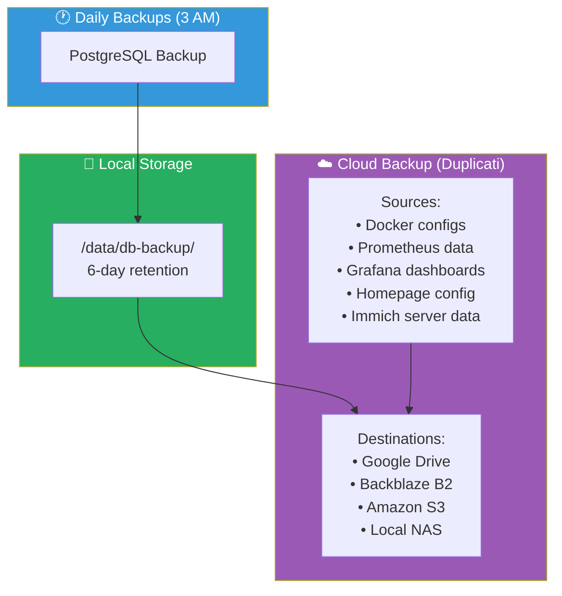
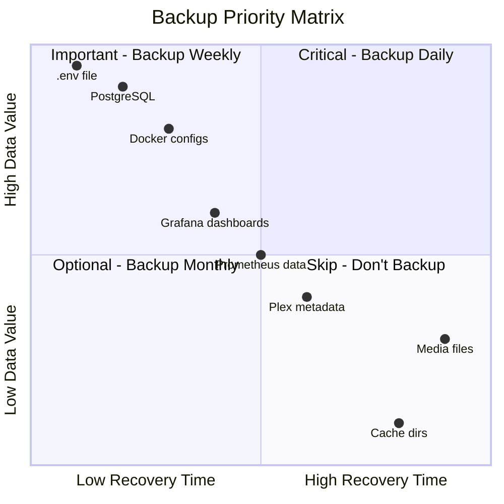
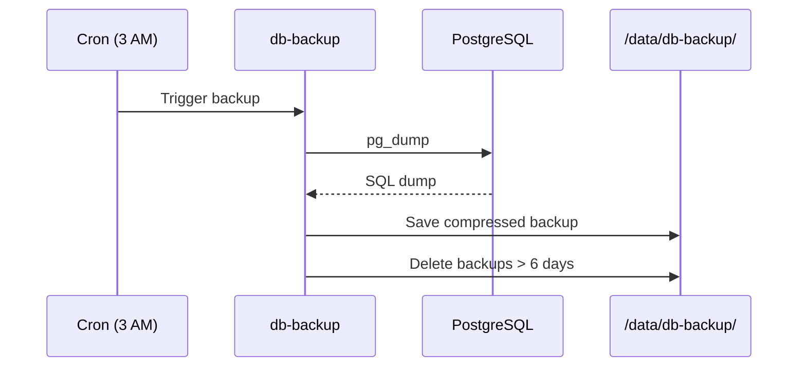
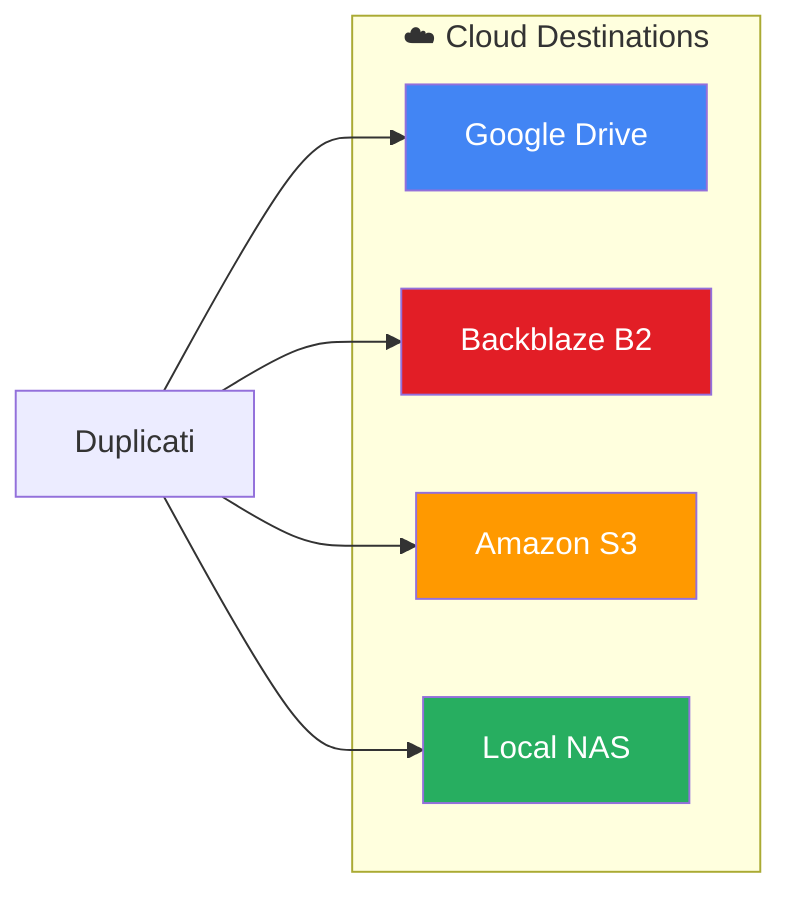
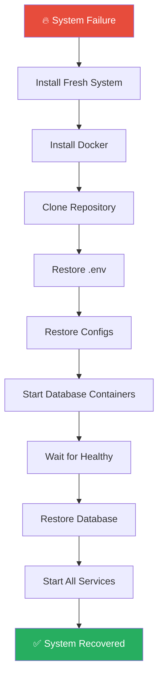
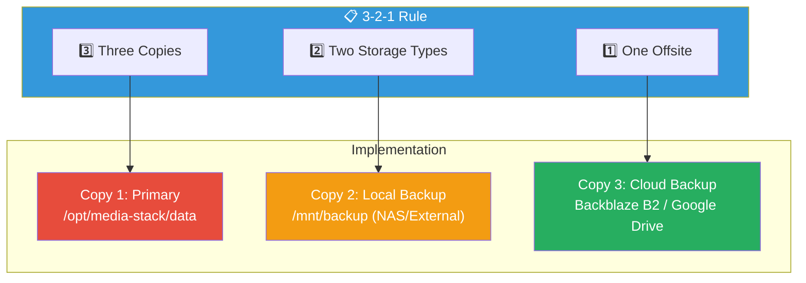

# 💾 Backup & Recovery Guide

[← Back to README](../README.md)

Complete guide to backing up your Media Stack and recovering from failures.

---

## Table of Contents

- [Backup Strategy](#backup-strategy)
- [What to Backup](#what-to-backup)
- [Automated Backups](#automated-backups)
- [Duplicati Setup](#duplicati-setup)
- [Database Backups](#database-backups)
- [Manual Backups](#manual-backups)
- [Recovery Procedures](#recovery-procedures)
- [Best Practices](#best-practices)

---

## Backup Strategy

### Overview



### Backup Schedule

| Backup Type | Schedule | Retention | Location |
|:------------|:---------|:----------|:---------|
| PostgreSQL | Daily 3:00 AM | 6 days | `/data/db-backup/` |
| Duplicati | Configurable | Configurable | Cloud storage |
| Manual | On-demand | As needed | Local/Remote |

---

## What to Backup

### Backup Priority Matrix



### Critical (Must Backup)

| Item | Location | Why |
|:-----|:---------|:----|
| `.env` file | Project root | All configuration |
| PostgreSQL (Immich) | Named volume | Photo metadata, ML data |
| Docker configs | `/data/*` | Service configurations |

> [!CAUTION]
> Losing your `.env` file means losing all passwords, API keys, and configuration. Back it up securely!

### Important (Should Backup)

| Item | Location | Why |
|:-----|:---------|:----|
| Grafana dashboards | `/data/grafana/` | Custom dashboards |
| Prometheus data | `/data/prometheus/` | Historical metrics |
| Homepage config | `/data/homepage/` | Dashboard customization |
| Uptime Kuma | `/data/uptime-kuma/` | Monitor history |

### Optional (Nice to Have)

| Item | Location | Why |
|:-----|:---------|:----|
| Plex metadata | `/data/plex/` | Watch history, playlists |
| *Arr configs | `/data/radarr/`, etc. | Quality profiles, history |

### Don't Backup

| Item | Reason |
|:-----|:-------|
| Media files | Too large, can re-download |
| Immich originals | Separate photo backup strategy |
| Cache directories | Regenerated automatically |
| Log files | Temporary data |

---

## Automated Backups

### PostgreSQL Backup Service



Enabled via `db-backup` profile:

```bash
docker compose --profile db-backup up -d
```

**Configuration:**
```yaml
db-backup:
  image: prodrigestivill/postgres-backup-local
  environment:
    POSTGRES_HOST: immich_postgres
    POSTGRES_DB: immich
    POSTGRES_USER: postgres
    POSTGRES_PASSWORD: ${DB_PASSWORD}
    SCHEDULE: "0 3 * * *"        # Daily at 3 AM
    BACKUP_KEEP_DAYS: 6          # Keep 6 days
    BACKUP_KEEP_WEEKS: 0
    BACKUP_KEEP_MONTHS: 0
```

**Backup location:** `/data/db-backup/`

SQLite-backed services such as Uptime Kuma and Grafana should be backed up manually or covered by your Duplicati jobs.

---

## Duplicati Setup

### Access

URL: `http://your-server:8200`

### Initial Configuration

1. Open Duplicati web UI
2. Click "Add backup"
3. Configure:
   - **Name:** Docker Configs Backup
   - **Encryption:** AES-256 (set passphrase)
   - **Destination:** Choose cloud provider

### Recommended Backup Jobs

```mermaid
gantt
    title Duplicati Backup Schedule
    dateFormat HH:mm
    axisFormat %H:%M

    section Daily
    Docker Configs    :04:00, 1h
    Database Backups  :05:00, 30m

    section Weekly
    Immich Server     :active, 06:00, 2h
```



#### Job 1: Docker Configs

| Setting | Value |
|:--------|:------|
| **Name** | Docker Configs |
| **Source** | `/source/docker-configs` |
| **Schedule** | Daily at 4 AM |
| **Retention** | Smart (default) |

**Folders to include:**
- `/source/docker-configs/homepage`
- `/source/docker-configs/grafana`
- `/source/docker-configs/prometheus`
- `/source/docker-configs/alertmanager`
- `/source/docker-configs/uptime-kuma`

#### Job 2: Database Backups

| Setting | Value |
|:--------|:------|
| **Name** | Database Backups |
| **Source** | `/source/db-backup` |
| **Schedule** | Daily at 5 AM |
| **Retention** | Keep 30 versions |

#### Job 3: Immich Server Data

| Setting | Value |
|:--------|:------|
| **Name** | Immich Server |
| **Source** | `/source/immich-server` |
| **Schedule** | Weekly |
| **Retention** | Keep 4 versions |

### Cloud Destinations



#### Google Drive

1. Select "Google Drive" as destination
2. Click "AuthID" to authenticate
3. Set folder path: `/Backups/MediaStack`

#### Backblaze B2

1. Select "B2 Cloud Storage"
2. Enter:
   - Account ID
   - Application Key
   - Bucket name

#### Amazon S3

1. Select "S3 Compatible"
2. Enter:
   - Server: `s3.amazonaws.com`
   - Bucket name
   - AWS Access Key
   - AWS Secret Key

### Encryption

> [!WARNING]
> Always enable encryption for cloud backups. Store your passphrase securely—without it, backups cannot be restored.

```
Encryption: AES-256
Passphrase: [strong-random-passphrase]
```

---

## Database Backups

### PostgreSQL (Immich)

#### Automatic (via db-backup service)

```bash
# Enable backup service
docker compose --profile db-backup up -d

# Check backup status
ls -la /opt/media-stack/data/db-backup/
```

#### Manual Backup

```bash
# Create backup
docker exec immich_postgres pg_dump -U postgres immich > immich_backup_$(date +%Y%m%d).sql

# Compressed backup
docker exec immich_postgres pg_dump -U postgres immich | gzip > immich_backup_$(date +%Y%m%d).sql.gz
```

#### Restore from Backup


```bash
# Stop Immich services
docker compose stop immich_server immich_machine_learning

# Restore database
docker exec -i immich_postgres psql -U postgres immich < immich_backup_20240101.sql

# Or from compressed
gunzip -c immich_backup_20240101.sql.gz | docker exec -i immich_postgres psql -U postgres immich

# Restart services
docker compose up -d
```

### SQLite Databases

#### Uptime Kuma

```bash
# Backup
sqlite3 /opt/media-stack/data/uptime-kuma/kuma.db ".backup /tmp/kuma_backup.db"

# Restore
cp /tmp/kuma_backup.db /opt/media-stack/data/uptime-kuma/kuma.db
docker compose restart uptime-kuma
```

#### Grafana

```bash
# Backup
sqlite3 /opt/media-stack/data/grafana/grafana.db ".backup /tmp/grafana_backup.db"

# Restore
cp /tmp/grafana_backup.db /opt/media-stack/data/grafana/grafana.db
docker compose restart grafana
```

---

## Manual Backups

### Quick Config Backup

```bash
# Full backup of all configs
tar -czvf media-stack-backup-$(date +%Y%m%d).tar.gz \
  /opt/media-stack/data \
  /opt/media-stack/.env \
  /opt/media-stack/docker-compose*.yml

# Store somewhere safe
mv media-stack-backup-*.tar.gz /mnt/backup/
```

### Backup .env File

```bash
# Critical! Contains all secrets
cp /opt/media-stack/.env /opt/media-stack/.env.backup.$(date +%Y%m%d)

# Encrypt sensitive backup
gpg -c /opt/media-stack/.env.backup.$(date +%Y%m%d)
```

> [!TIP]
> Store your encrypted `.env` backup in a password manager or secure cloud storage separate from your main backups.

### Backup Specific Service

```bash
# Backup single service config
tar -czvf plex-backup-$(date +%Y%m%d).tar.gz /opt/media-stack/data/plex

# Backup multiple services
tar -czvf arr-backup-$(date +%Y%m%d).tar.gz \
  /opt/media-stack/data/radarr \
  /opt/media-stack/data/sonarr \
  /opt/media-stack/data/prowlarr
```

---

## Recovery Procedures

### Full System Recovery



1. **Install fresh system**
   - Install Docker
   - Clone repository

2. **Restore .env**
   ```bash
   cp /backup/.env.backup /opt/media-stack/.env
   ```

3. **Restore configs**
   ```bash
   tar -xzvf media-stack-backup-20240101.tar.gz -C /
   ```

4. **Restore databases**
   ```bash
   # Start database containers first
   docker compose up -d immich_postgres redis

   # Wait for healthy status
   sleep 30

   # Restore PostgreSQL
   docker exec -i immich_postgres psql -U postgres immich < immich_backup.sql
   ```

5. **Start all services**
   ```bash
   docker compose up -d
   ```

### Single Service Recovery

```bash
# Stop the service
docker compose stop plex

# Restore config
tar -xzvf plex-backup-20240101.tar.gz -C /

# Restart service
docker compose up -d plex
```

### Database Recovery

```bash
# Stop dependent services
docker compose stop immich_server immich_machine_learning

# Drop and recreate database
docker exec immich_postgres psql -U postgres -c "DROP DATABASE immich;"
docker exec immich_postgres psql -U postgres -c "CREATE DATABASE immich;"

# Restore from backup
docker exec -i immich_postgres psql -U postgres immich < backup.sql

# Restart services
docker compose up -d
```

### Recover from Duplicati

1. Open Duplicati: `http://your-server:8200`
2. Select backup job
3. Click "Restore"
4. Choose files/folders
5. Select restore location
6. Click "Restore"

---

## Best Practices

### 3-2-1 Backup Rule



### Test Restores

> [!IMPORTANT]
> Untested backups are not backups. Regularly test your restore procedures!

```bash
# Create test directory
mkdir /tmp/restore-test

# Restore backup
tar -xzvf media-stack-backup-20240101.tar.gz -C /tmp/restore-test

# Verify files
ls -la /tmp/restore-test/opt/media-stack/data/

# Cleanup
rm -rf /tmp/restore-test
```

### Monitor Backup Jobs

- Check Duplicati email reports
- Monitor backup sizes
- Verify backup completion in logs

### Secure Your Backups

- Encrypt all backups
- Store encryption keys separately
- Use strong passphrases
- Rotate backup locations

### Document Recovery

Keep a recovery document with:
- Backup locations
- Encryption passphrases
- Recovery steps
- Service dependencies

---

## Backup Checklist

### Daily
- [ ] Verify automated backups ran
- [ ] Check backup sizes

### Weekly
- [ ] Review Duplicati job status
- [ ] Check cloud storage usage
- [ ] Verify database backups

### Monthly
- [ ] Test restore procedure
- [ ] Update .env backup
- [ ] Review backup retention

### Quarterly
- [ ] Full system backup test
- [ ] Update recovery documentation
- [ ] Review backup strategy

---

## Related Documentation

- [Configuration](configuration.md) - Service configuration
- [Troubleshooting](troubleshooting.md) - Recovery issues
- [Architecture](architecture.md) - System design

---

[← Back to README](../README.md)
