<!-- Generated by scripts/build-docmost-space.py. Edit the source page in docs/ instead. -->

# 🏗️ Architecture

This document explains the system architecture, design decisions, and data flows of the Media Stack infrastructure.

---

## Table of Contents

- [System Overview](#system-overview)
- [Network Topology](#network-topology)
- [Data Flows](#data-flows)
- [Service Dependencies](#service-dependencies)
- [Storage Architecture](#storage-architecture)
- [Hardware Acceleration](#hardware-acceleration)

---

## System Overview

The infrastructure is organized into logical service groups, each handling a specific function:

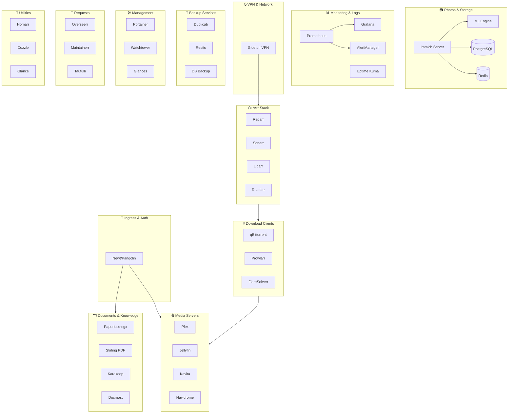

### Service Groups

| Group | Purpose | Key Services |
|:------|:--------|:-------------|
| **Ingress** | External access & authentication | Newt, Pangolin |
| **Media Servers** | Content streaming | Plex, Jellyfin, Kavita, Navidrome |
| **Photos** | Photo management & ML | Immich, PostgreSQL, Redis |
| **Monitoring** | Metrics & alerting | Prometheus, Grafana, AlertManager, Uptime Kuma |
| **Documents & Knowledge** | Docs, PDF tools, bookmarks, wiki | Paperless-ngx, Stirling-PDF, Karakeep, Docmost |
| **VPN** | Privacy & network routing | Gluetun |
| **\*Arr Stack** | Media automation | Radarr, Sonarr, Lidarr, Readarr |
| **Downloaders** | Content acquisition | qBittorrent, Prowlarr |
| **Backup** | Data protection | Duplicati, Restic Server, DB Backup |
| **Management** | Container operations | Portainer, Watchtower, Glances |
| **Requests** | User request portals | Overseerr, Maintainerr |
| **Utilities** | Tools & dashboards | Homarr, Dozzle, Glance |

---

## Network Topology

All services operate on a single Docker bridge network with VPN routing for sensitive traffic:

```mermaid
graph TB
    Internet((🌐 Internet))

    Internet --> Pangolin
    Internet --> Gluetun

    subgraph EXTERNAL["External Access"]
        Pangolin["Pangolin/Newt<br/>Secure Tunnel"]
    end

    subgraph VPN_GATEWAY["VPN Gateway"]
        Gluetun["Gluetun<br/>Mullvad/NordVPN"]
    end

    subgraph DOCKER["Docker Network: media-stack<br/>Subnet: 172.20.0.0/16"]
        subgraph VPN_ROUTED["🔒 VPN-Routed Services"]
            Radarr["Radarr<br/>:7878"]
            Sonarr["Sonarr<br/>:8989"]
            Lidarr["Lidarr<br/>:8686"]
            Readarr["Readarr<br/>:8787"]
            qBit["qBittorrent<br/>:8080"]
            Prowlarr["Prowlarr<br/>:9696"]
            Bazarr["Bazarr<br/>:6767"]
            Flare["FlareSolverr<br/>:8191"]
        end

        subgraph DIRECT["🌍 Direct Access Services"]
            Plex["Plex<br/>:32400"]
            Jellyfin["Jellyfin<br/>:8096"]
            Immich["Immich<br/>:2283"]
            Grafana["Grafana<br/>:3000"]
            Homarr["Homarr<br/>:3002"]
            Paperless["Paperless<br/>:8010"]
        end
    end

    Pangolin --> DIRECT
    Gluetun --> VPN_ROUTED

    style VPN_ROUTED fill:#2d5a27,stroke:#4a9f41
    style DIRECT fill:#1a4a6e,stroke:#3498db
    style VPN_GATEWAY fill:#8b4513,stroke:#d2691e
```

### Network Zones

| Zone | Traffic Type | Services |
|:-----|:-------------|:---------|
| **VPN-Routed** | All traffic through VPN tunnel | *Arr stack, qBittorrent, Prowlarr |
| **Direct Access** | Normal network access | Media servers, monitoring, utilities, documents |
| **Internal Only** | Container-to-container only | Databases, Redis, internal APIs |

---

## Data Flows

### Media Acquisition Flow

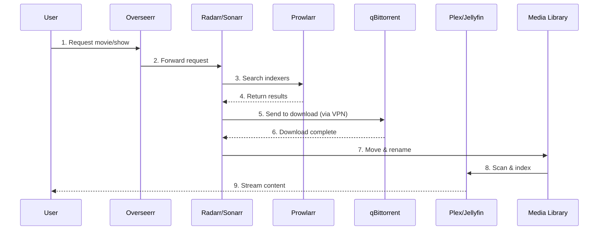

**Flow Steps:**
1. User submits request via Overseerr
2. Radarr/Sonarr receives and processes request
3. Prowlarr searches configured indexers
4. Best release selected based on quality profile
5. qBittorrent downloads through VPN tunnel
6. Download completes and is imported
7. *Arr stack moves and renames files
8. Plex/Jellyfin scans and indexes new content
9. User streams content

### Photo Management Flow

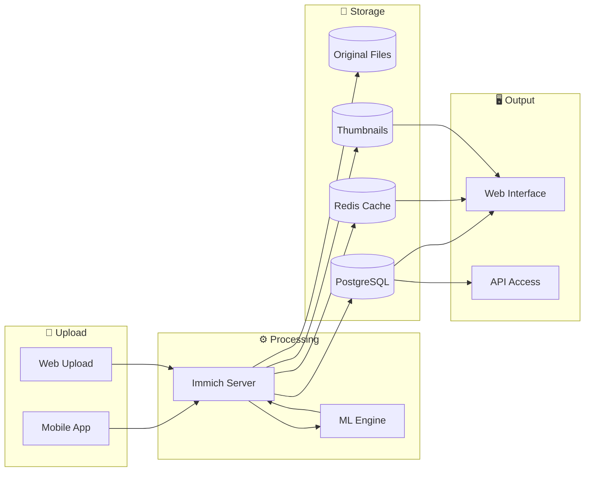

**Processing Pipeline:**


### Monitoring Data Flow

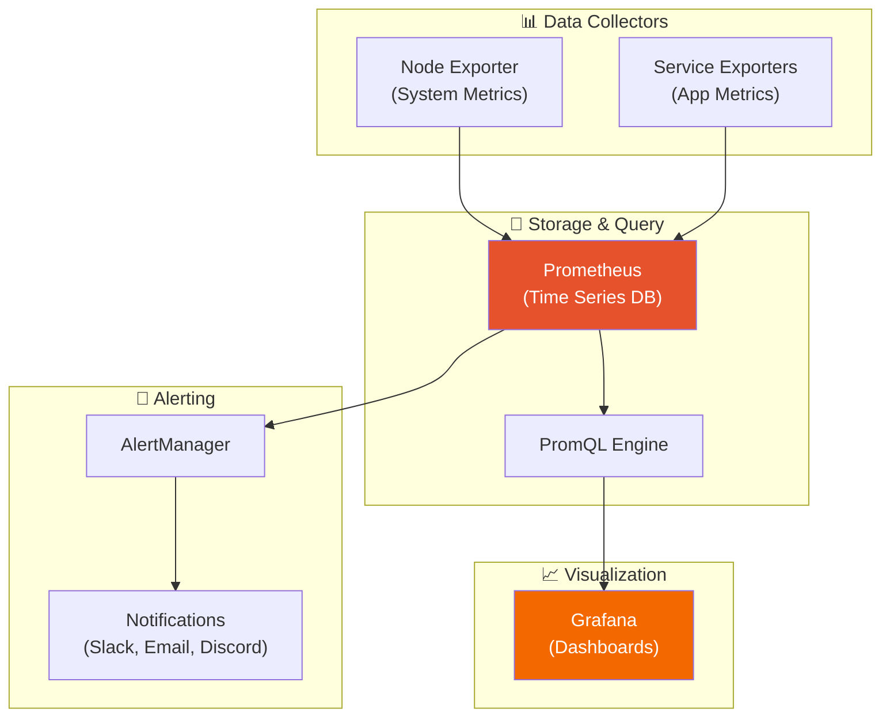

---

## Service Dependencies

### Critical Dependency Chain

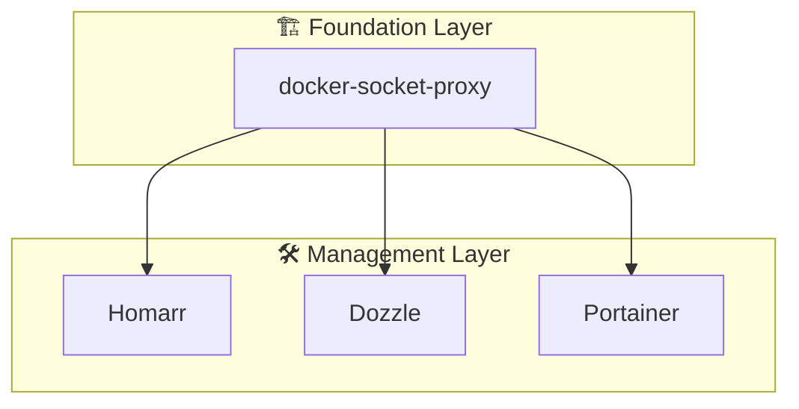

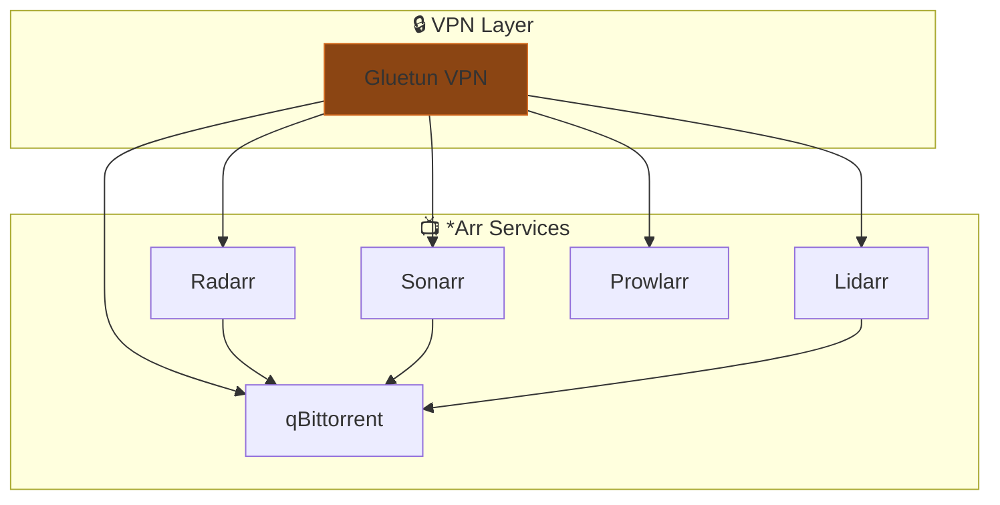

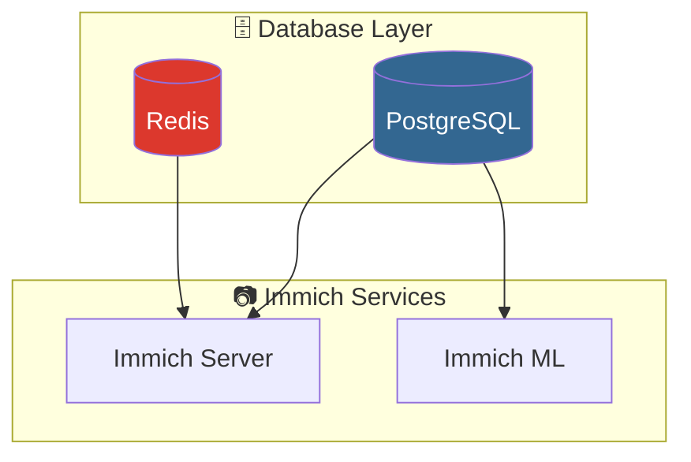

### Startup Order

| Order | Services | Wait For |
|:-----:|:---------|:---------|
| 1 | docker-socket-proxy | - |
| 2 | gluetun, databases | docker-socket-proxy |
| 3 | *Arr stack, Redis | gluetun, databases |
| 4 | Media servers, Immich | databases, Redis |
| 5 | Request portals | Media servers, *Arr |
| 6 | Monitoring, utilities | All core services |

---

## Storage Architecture

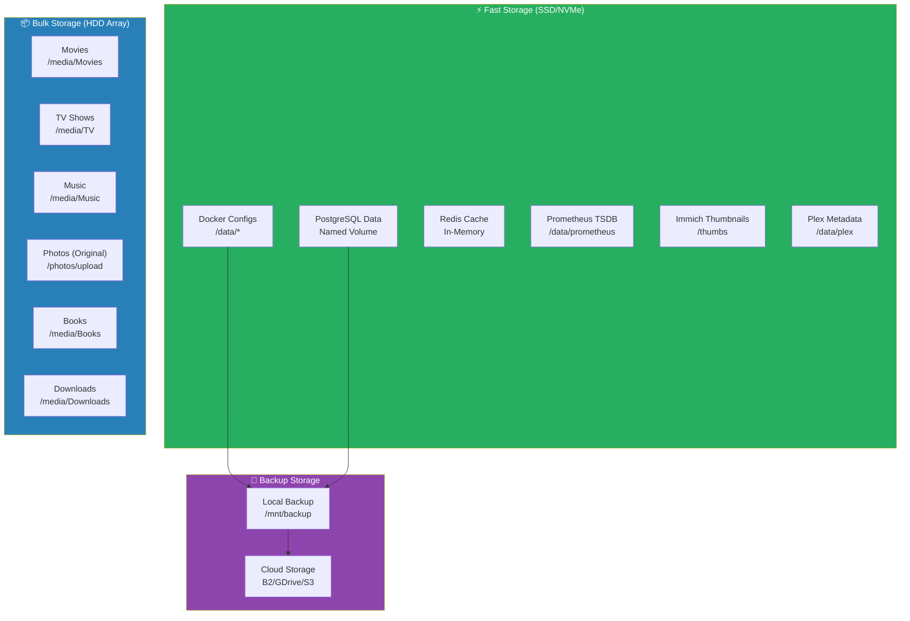

### Storage Layout

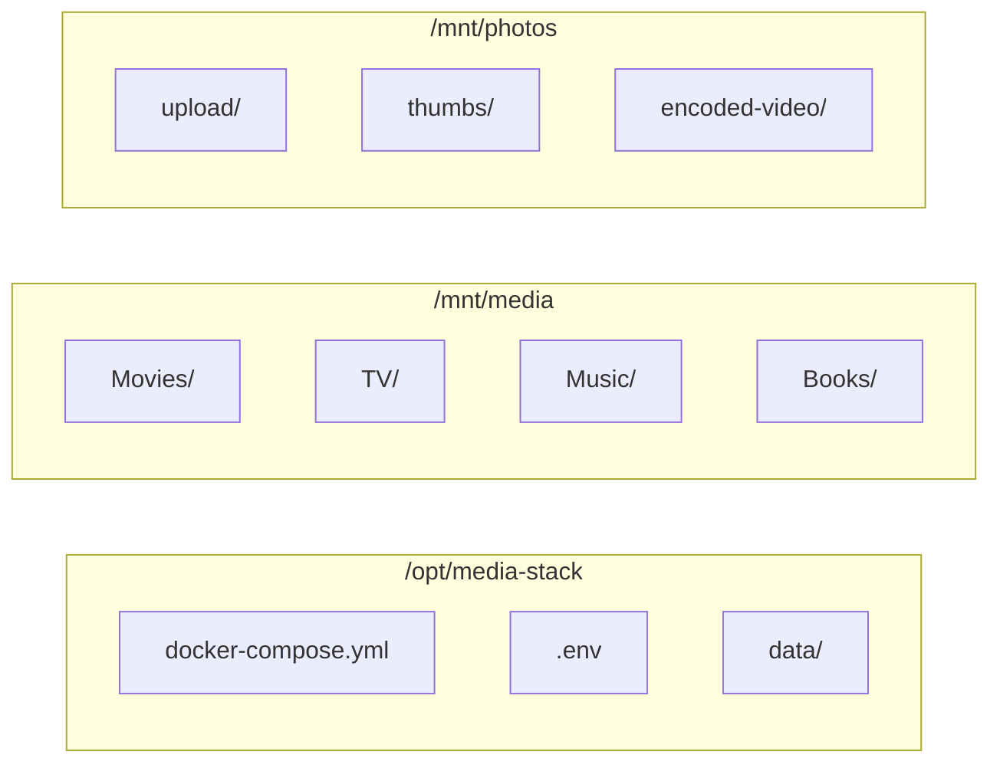

### Volume Types

| Type | Use Case | Performance | Persistence |
|:-----|:---------|:------------|:------------|
| **Bind Mounts** | Configs, media libraries | Native | Host filesystem |
| **Named Volumes** | Database data | Native | Docker managed |
| **tmpfs** | Temporary files, cache | RAM speed | Non-persistent |

---

## Hardware Acceleration

### Transcoding Pipeline

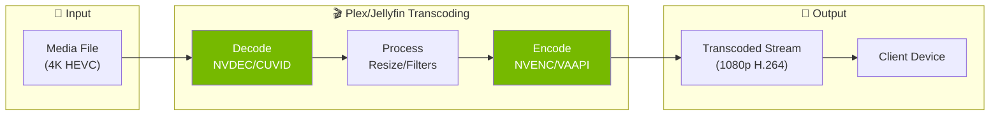

### Hardware Options

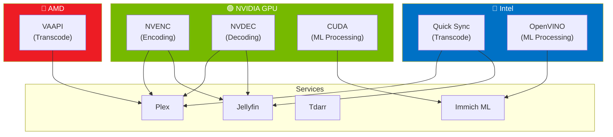

### Acceleration Options

| Type | Hardware | Services | Config File |
|:-----|:---------|:---------|:------------|
| **NVENC/NVDEC** | NVIDIA GPU | Plex, Jellyfin | `hwaccel.transcoding.yml` |
| **Quick Sync** | Intel iGPU | Plex, Jellyfin | `hwaccel.transcoding.yml` |
| **VAAPI** | AMD/Intel | Plex, Jellyfin | `hwaccel.transcoding.yml` |
| **CUDA** | NVIDIA GPU | Immich ML | `hwaccel.ml.yml` |
| **OpenVINO** | Intel | Immich ML | `hwaccel.ml.yml` |

### Enable GPU Support

```yaml
# In docker-compose.media-servers.yml
plex:
  extends:
    file: hwaccel.transcoding.yml
    service: nvenc  # or quicksync, vaapi
```

---

## Design Decisions

### Why Single Network?

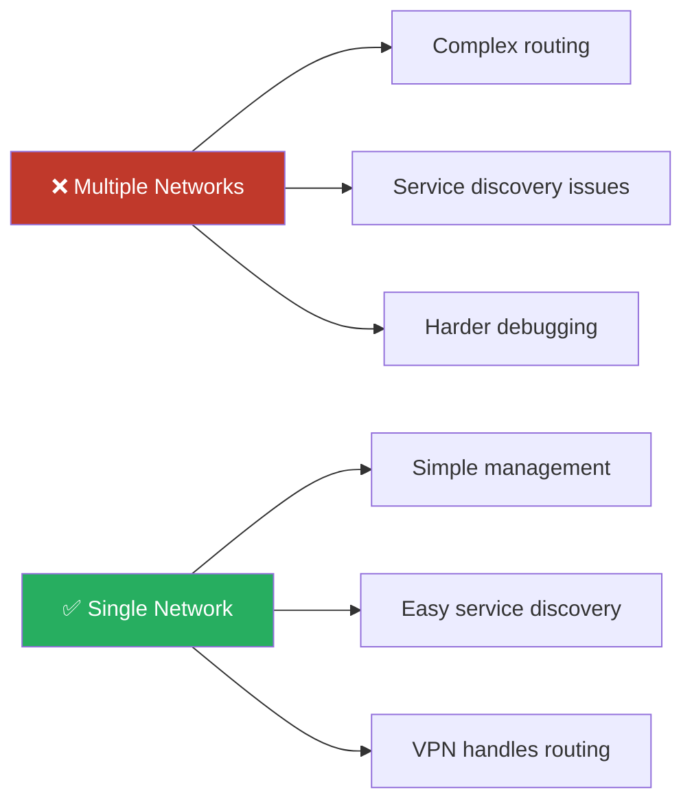

- **Simplicity**: Easier to manage and troubleshoot
- **Service Discovery**: All services can reach each other by name
- **VPN Routing**: Gluetun handles selective traffic routing

### Why Modular Compose Files?

- **Flexibility**: Enable only needed services
- **Organization**: Logical grouping of related services
- **Maintenance**: Easier to update individual components

### Why Docker Socket Proxy?

- **Security**: Prevents direct socket access
- **Read-Only**: Most services only need read access
- **Isolation**: Limits container permissions

---

## Related Documentation

- [Services Catalog](Services Catalog.md) - Complete list of all services
- [Networking](Networking Guide.md) - Detailed network configuration
- [Configuration](Configuration Guide.md) - Module system and profiles

---
