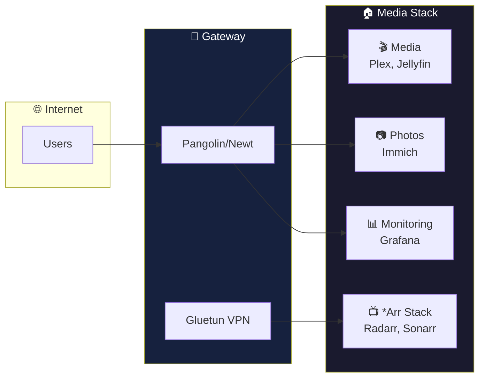
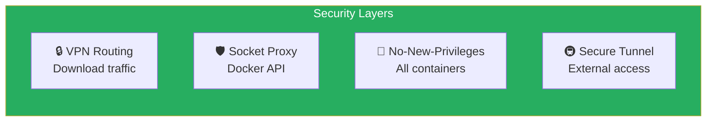

<!-- Generated by scripts/build-docmost-space.py. Edit README.md and docs/*.md instead. -->

# Home

This space mirrors the repository documentation in a Docmost-friendly layout.

### Self-Hosted Homelab Infrastructure

*A complete, modular, production-ready Docker Compose setup for running your own media, photo, productivity, document, knowledge, monitoring, and automation services.*

[Quick Start](#-quick-start) •
[Documentation](#-documentation) •
[Services](#-whats-included) •
[Support](#-getting-help)

---

## 🎯 Overview



## ✨ What's Included

<table>
<tr>
<td width="33%">

### 🎬 Media
- Plex & Jellyfin
- *Arr Stack (Radarr, Sonarr, etc.)
- Immich (Photos)
- Kavita & Navidrome

</td>
<td width="33%">

### 🧠 Productivity
- FreshRSS & SearXNG
- Syncthing
- Joplin Server
- Paperless, Karakeep & Docmost
- Optional Kasm

</td>
<td width="33%">

### 🔧 Operations
- Portainer
- Prometheus + Grafana
- Watchtower
- Homarr Dashboard
- Duplicati Backups

</td>
</tr>
</table>

### 📞 Communication

- Jitsi Meet on the optional `jitsi` profile
- Pangolin serves `https://meet.${DOMAIN_NAME}` for the web and app entrypoint
- Direct-first media and home-only fallback use `rtc.${DOMAIN_NAME}` plus home port forwards for JVB and TURN
- Runbook: [Jitsi Meet Guide](Jitsi Meet.md)

> **50+ services** organized into modular compose files. Enable only what you need.

---

## 🚀 Quick Start

```bash
# 1. Clone the repository
git clone https://github.com/manumanohar11/homelab.git /opt/media-stack
cd /opt/media-stack

# 2. Bootstrap environment
make init-env
nano .env  # Edit host paths, domain, API keys, and optional settings

# `make init-env` copies `.env.example` to `.env` when needed
# and generates any missing required secrets automatically.

# 3. Create directories
sudo mkdir -p /opt/media-stack/data /mnt/media/{Movies,TV,Music,Photos,Sync}
sudo mkdir -p /mnt/media/Documents/consume
sudo chown -R $USER:$USER /opt/media-stack /mnt/media

# 4. Launch!
docker compose up -d
```

The stack now fails fast during `docker compose config` and `docker compose up -d` if required secrets are unset, and `make init-env` fills those required secrets for first-time setup.

```bash
# Optional: discover the repo's common operator shortcuts
make help
```

> First-time setup: start with the [Quick Start Guide](Quick Start Guide.md).

---

## 📚 Documentation

| Document | Description |
|:---------|:------------|
| [🚀 Quick Start Guide](Quick Start Guide.md) | First-time setup, prerequisites, installation |
| [🏗️ Architecture](Architecture.md) | System diagrams, data flows, design decisions |
| [📦 Services Catalog](Services Catalog.md) | Operator catalog of user-facing services and critical backends |
| [⚙️ Configuration](Configuration Guide.md) | Module system, profiles, environment variables |
| [📞 Jitsi Meet](Jitsi Meet.md) | Jitsi deployment, home-media setup, moderator flow, and troubleshooting |
| [🌐 Networking](Networking Guide.md) | Network topology, VPN routing, port reference |
| [📊 Monitoring](Monitoring Guide.md) | Prometheus, Grafana, alerting setup |
| [📋 Logging](Logging Guide.md) | Simple container logging with Loki and Promtail |
| [💾 Backup & Recovery](Backup & Recovery Guide.md) | Backup strategy, schedules, restore procedures |
| [📝 Docmost Publishing](Docmost Publishing.md) | Import-ready wiki flow, page bundle, and Docmost-specific notes |
| [🔧 Troubleshooting](Troubleshooting Guide.md) | Common issues, FAQ, debugging commands |
| [🛠️ Utility Scripts](Utility Scripts.md) | Template sync and repo validation utilities |

---

## 📝 Use in Docmost

The markdown under `README.md` and `docs/` stays the canonical source in git.

When you want a simpler wiki view inside Docmost:

1. Build the import bundle with `make docs-build` or `python3 scripts/build-docmost-space.py`
2. Validate docs and compose drift with `make check`
3. Import `docs/docmost-space/` into a Docmost space
4. Keep editing the canonical repo docs, then rebuild the Docmost bundle

See [Docmost Publishing](Docmost Publishing.md) for the full workflow.

---

## 🗂️ Project Structure

```
.
├── docker-compose.yml          # Main orchestration (includes modules)
├── docker-compose.*.yml        # Service modules
├── docker-compose.local.example.yml # Host-specific override example
├── hwaccel.*.yml               # Hardware acceleration configs
├── .env.example                # Configuration template
├── docs/                       # 📚 Documentation
├── config-templates/           # Git-tracked config templates
└── data/                       # Runtime data (gitignored)
```

---

## 🎯 Common Tasks

### Start/Stop Services

```bash
# Start all services
docker compose up -d

# Start with optional profiles
docker compose --profile speedtest --profile scrutiny up -d

# Start Jitsi Meet private calling
docker compose --profile jitsi up -d

# Start optional Kasm workspaces
docker compose --profile kasm up -d

# Stop everything
docker compose down

# Restart a service
docker compose restart plex
```

```bash
# Or use the Makefile wrappers
make up PROFILES="speedtest scrutiny"
make restart SERVICE=plex
make logs SERVICE=plex
```

### Update Containers

```bash
# Update all
docker compose pull && docker compose up -d

# Update specific service
docker compose pull plex && docker compose up -d plex

# Validate stack consistency and config drift
make check
```

LinuxServer.io containers are intentionally opted out of Watchtower in this repo. Update those with `docker compose pull <service> && docker compose up -d <service>` after reviewing release notes.

### View Logs

```bash
# Follow all logs
docker compose logs -f

# Specific service
docker compose logs -f plex

# Or use Dozzle UI at http://your-server:8889
```

### Access Services

| Service | URL |
|:--------|:----|
| Homarr | `http://your-server:3002` |
| Jitsi Meet | `https://meet.${DOMAIN_NAME}` |
| Plex | `http://your-server:32400/web` |
| Immich | `http://your-server:2283` |
| FreshRSS | `http://your-server:8081` |
| Joplin | `http://your-server:22300` |
| Grafana | `http://your-server:3000` |
| Portainer | `https://your-server:9443` |

See [Services Catalog](Services Catalog.md) for complete list.

---

## 🔒 Security Highlights



- **VPN Routing** - Download traffic through Gluetun (Mullvad/NordVPN)
- **Docker Socket Proxy** - Secure API access for containers
- **No-New-Privileges** - Applied to all containers
- **Pangolin/Newt** - Secure external tunneling

See [Configuration Guide](Configuration Guide.md#security) for security best practices.

---

## 📋 Requirements

| Component | Minimum | Recommended |
|:----------|:-------:|:-----------:|
| CPU | 4 cores | 8+ cores |
| RAM | 8 GB | 16+ GB |
| Storage | 50 GB SSD | 100+ GB NVMe |
| OS | Ubuntu 22.04 | Ubuntu 24.04 LTS |

> Optional: NVIDIA GPU for hardware transcoding and Immich ML acceleration.

---

## 🆘 Getting Help

1. **Check the docs** - Start with [Troubleshooting](Troubleshooting Guide.md)
2. **View logs** - `docker compose logs [service]` or use Dozzle
3. **Search issues** - Check existing GitHub issues

### Useful Resources

- [LinuxServer.io Docs](https://docs.linuxserver.io/) - Container documentation
- [Trash Guides](https://trash-guides.info/) - *Arr best practices
- [Servarr Wiki](https://wiki.servarr.com/) - *Arr suite documentation
- [r/selfhosted](https://reddit.com/r/selfhosted) - Community support

---

## 📜 License

This project is provided as-is for personal use.
Individual services have their own licenses.

---

**Made with ❤️ for the self-hosting community**