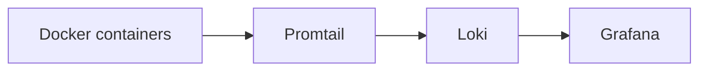

<!-- Generated by scripts/build-docmost-space.py. Edit the source page in docs/ instead. -->

# Logging Guide

Simple centralized container logging with Loki, Promtail, and Grafana.

---

## Overview

This logging stack is intentionally narrow in scope:

- `Promtail` collects Docker container logs
- `Loki` stores them
- `Grafana` lets you search and visualize them

It does not try to parse host auth logs, system journals, or maintain a second log pipeline.

If you only want live logs and do not care about retention or searching, use `Dozzle` at `http://your-server:8889` instead.

### Data Flow



---

## Quick Start

### 1. Sync tracked config

```bash
./scripts/sync-monitoring-config.sh
```

This copies the tracked templates from `config-templates/` into your runtime directories under `${DOCKER_BASE_DIR}`.

### 2. Start the stack

```bash
docker compose up -d loki promtail grafana
```

### 3. Open Grafana

1. Go to `http://your-server:3000`
2. Sign in with `GRAFANA_ADMIN_USER` and the password from your `.env`
3. Open the `Homelab` folder

---

## What You Get

### Components

| Service | Purpose | Notes |
|:--------|:--------|:------|
| `loki` | Stores and indexes logs | 31-day retention by default |
| `promtail` | Ships Docker logs to Loki | Container logs only |
| `grafana` | Queries and visualizes logs | Uses the pre-provisioned Loki datasource |

### Labels You Can Filter By

Promtail keeps the labels beginner-friendly:

- `container`
- `compose_service`
- `compose_project`
- `stream`
- `image`

### Dashboards

The repo now keeps the default dashboards focused on container logs:

- `Logs Overview`
- `Container Logs`
- `Media Stack Logs`

---

## Useful Queries

```logql
# All container logs
{job="docker"}

# One container
{container="plex"}

# One compose service
{compose_service="immich-server"}

# Errors
{job="docker"} |~ "(?i)(error|err|fatal|panic|exception)"

# Warnings
{job="docker"} |~ "(?i)(warn|warning)"
```

---

## Files That Matter

| Purpose | Path |
|:--------|:-----|
| Loki template | `config-templates/loki/local-config.yaml` |
| Promtail template | `config-templates/promtail/config.yml` |
| Grafana provisioning | `config-templates/grafana/provisioning/` |
| Runtime sync script | `scripts/sync-monitoring-config.sh` |

After syncing, the live runtime copies are under `${DOCKER_BASE_DIR}`.

---

## Maintenance

### Check for config drift

```bash
./scripts/sync-monitoring-config.sh --check
```

### Re-sync runtime config

```bash
./scripts/sync-monitoring-config.sh
docker compose restart loki promtail grafana
```

### Check log stack health

```bash
docker compose logs promtail --tail 50
docker compose logs loki --tail 50
curl http://localhost:3100/loki/api/v1/labels
```

### Check Loki disk usage

```bash
du -sh ${DOCKER_BASE_DIR}/loki/data
```

---

## Design Choices

This repo keeps logging simple on purpose:

- one log shipper instead of both Promtail and Vector
- container logs only instead of host log parsing
- Grafana dashboards instead of extra log alert rules
- tracked templates synced into runtime config with one script

That gives you searchable historical logs without turning logging into its own mini-platform.