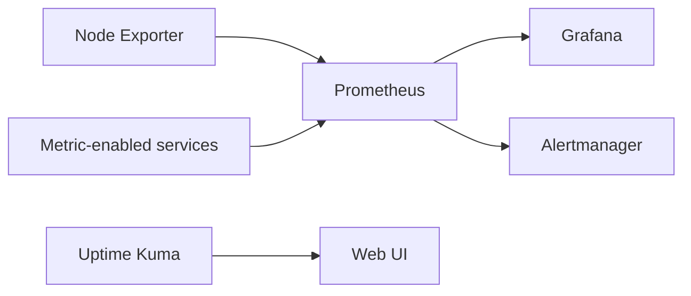

<!-- Generated by scripts/build-docmost-space.py. Edit the source page in docs/ instead. -->

# Monitoring Guide

Simple monitoring guidance for this homelab.

---

## Overview

The default monitoring stack is intentionally small:

- `Prometheus` stores metrics
- `Grafana` visualizes them
- `Node Exporter` provides host metrics
- `Uptime Kuma` handles simple uptime checks
- `Alertmanager` is pre-wired, but mostly idle until you add real rules and notification receivers

Logging is documented separately in `docs/logging.md`.

### Data Flow



---

## Default Services

| Service | URL | Purpose |
|:--------|:----|:--------|
| Grafana | `http://your-server:3000` | Metrics and logs UI |
| Prometheus | `http://your-server:9090` | Metrics storage and query |
| Alertmanager | `http://your-server:9093` | Alert routing scaffold |
| Uptime Kuma | `http://your-server:3001` | Simple uptime monitoring |
| Node Exporter | none | Host metrics endpoint |

### Optional Monitoring Profiles

| Profile | Service | Purpose |
|:--------|:--------|:--------|
| `monitoring` | Glances | Lightweight system monitor |
| `speedtest` | Speedtest Tracker | Internet speed history |
| `scrutiny` | Scrutiny | Disk health |

---

## What Is Preconfigured

### Prometheus

The tracked Prometheus template is:

`config-templates/prometheus/prometheus.yml`

It is synced into the runtime copy at:

`${DOCKER_BASE_DIR}/prometheus/config/prometheus.yml`

Default scrape targets are intentionally simple:

- Prometheus
- Alertmanager
- Node Exporter
- Grafana
- optional app metrics if they expose `/metrics`

### Grafana

Grafana comes with datasources preconfigured for:

- Prometheus
- Loki
- Alertmanager

The repo currently tracks log dashboards by default. For metrics dashboards, the beginner-friendly path is to import them into Grafana only when you actually need them.

Sign in with `GRAFANA_ADMIN_USER` and the password from `.env`.

### Alertmanager

Alertmanager is kept minimal on purpose.

- the service runs by default
- the config is intentionally small
- nothing becomes useful until you add real Prometheus alert rules and notification receivers

That means you can ignore it at first if you only want metrics and dashboards.

---

## Syncing Runtime Config

Edit the tracked templates first, then sync them into the runtime directories.

```bash
./scripts/sync-monitoring-config.sh
```

To check for drift later:

```bash
./scripts/sync-monitoring-config.sh --check
```

---

## Recommended Beginner Workflow

### 1. Start the core stack

```bash
docker compose up -d prometheus grafana uptime-kuma node-exporter alertmanager
```

### 2. Confirm health

```bash
docker compose ps prometheus grafana uptime-kuma node-exporter alertmanager
curl http://localhost:3000/api/health
curl http://localhost:9090/-/healthy
curl http://localhost:9093/-/healthy
```

### 3. Use the right tool for the job

- use `Uptime Kuma` for simple up/down checks
- use `Grafana + Prometheus` for metrics and trends
- ignore `Alertmanager` until you are ready for real notifications

Good first Uptime Kuma checks are `Immich`, `Plex`, `Paperless-ngx`, and `Docmost`.

---

## Useful Queries

```promql
# Are scrape targets up?
up

# Host CPU usage
100 - (avg by(instance) (irate(node_cpu_seconds_total{mode="idle"}[5m])) * 100)

# Host memory usage
(1 - (node_memory_MemAvailable_bytes / node_memory_MemTotal_bytes)) * 100

# Host disk usage
(1 - (node_filesystem_avail_bytes / node_filesystem_size_bytes)) * 100
```

---

## Files That Matter

| Purpose | Path |
|:--------|:-----|
| Prometheus template | `config-templates/prometheus/prometheus.yml` |
| Alertmanager template | `config-templates/alertmanager/alertmanager.yml` |
| Grafana datasources | `config-templates/grafana/provisioning/datasources/datasources.yml` |
| Runtime sync script | `scripts/sync-monitoring-config.sh` |

---

## If You Want Less Complexity

You do not need to use every monitoring feature.

- keep `Prometheus`, `Grafana`, and `Uptime Kuma`
- treat `Alertmanager` as optional-to-configure infrastructure
- add `Glances`, `Scrutiny`, or `Speedtest Tracker` only when you know you want them
- import extra Grafana dashboards only after you miss something specific

That keeps the monitoring story practical instead of turning it into a second job.