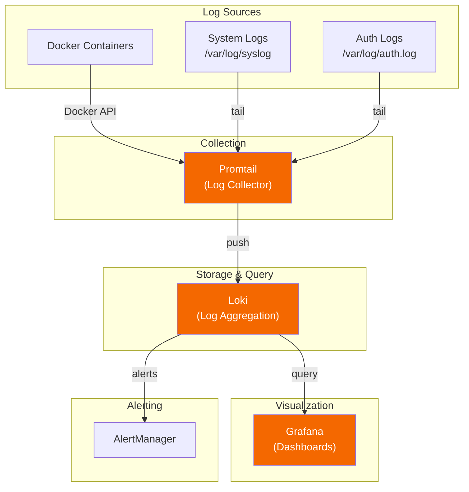

# Logging Guide

[← Back to README](../README.md)

Complete guide to centralized logging with Loki, Promtail, and Grafana dashboards.

---

## Table of Contents

- [Overview](#overview)
- [Quick Start](#quick-start)
- [Components](#components)
- [Dashboards](#dashboards)
- [LogQL Queries](#logql-queries)
- [Alerting](#alerting)
- [Configuration](#configuration)
- [Maintenance](#maintenance)

---

## Overview

### Architecture



### Access Points

| Service | URL | Purpose |
|:--------|:----|:--------|
| **Grafana** | `http://your-server:3000` | View dashboards and explore logs |
| **Loki** | `http://your-server:3100` | Log aggregation API |

---

## Quick Start

### 1. Enable the Logging Stack

The logging module is included in `docker-compose.yml`. Make sure it's uncommented:

```yaml
include:
  # ...
  - docker-compose.logging.yml  # Loki/Promtail stack
```

### 2. Run the Setup Script

```bash
./scripts/setup-logging.sh
```

This copies all configuration files to the correct locations.

### 3. Start the Services

```bash
docker compose up -d loki promtail grafana
```

### 4. Access Grafana

1. Open `http://your-server:3000`
2. Login with `admin` / `admin`
3. Go to **Dashboards → Homelab** folder
4. Open **Logs Overview**

---

## Components

### Loki

Log aggregation system (like Prometheus, but for logs).

| Setting | Value |
|:--------|:------|
| **Port** | 3100 |
| **Retention** | 31 days |
| **Storage** | `${DOCKER_BASE_DIR}/loki/data` |
| **Config** | `${DOCKER_BASE_DIR}/loki/config/local-config.yaml` |

### Promtail

Log collector that ships logs to Loki.

| Feature | Description |
|:--------|:------------|
| **Docker logs** | Auto-discovers all containers |
| **System logs** | `/var/log/syslog` |
| **Auth logs** | `/var/log/auth.log` |
| **Labels** | Adds container, service_type, job labels |

### Collected Log Sources

| Job | Source | Labels Added |
|:----|:-------|:-------------|
| `docker` | All Docker containers | `container`, `compose_service`, `service_type` |
| `system` | `/var/log/syslog` | `job=system`, `host` |
| `auth` | `/var/log/auth.log` | `job=auth`, `username`, `src_ip` |
| `kernel` | `/var/log/kern.log` | `job=kernel` |

---

## Dashboards

Four pre-configured dashboards are automatically provisioned:

### Logs Overview

**Location:** Dashboards → Homelab → Logs Overview

| Panel | Description |
|:------|:------------|
| Total Log Lines | Count of all logs in time range |
| Error Count | Logs matching error/fail/fatal |
| Active Containers | Containers currently logging |
| Auth Failures | Failed authentication attempts |
| Log Volume by Container | Stacked bar chart |
| Error & Warning Rate | Time series of errors/warnings |
| Errors by Container | Table sorted by error count |
| Log Distribution | Pie chart by container |
| Recent Errors | Live error log stream |

### Container Logs

**Location:** Dashboards → Homelab → Container Logs

Deep-dive into individual container logs:

- **Container dropdown** - Select specific containers
- **Search box** - Filter logs by text
- **Log levels** - Stats for error/warn/info/debug
- **Log size** - Bytes logged in time range
- **Live logs** - Real-time log stream

### Media Stack Logs

**Location:** Dashboards → Homelab → Media Stack Logs

Focused on media services:

| Section | Services |
|:--------|:---------|
| *Arr Suite | Radarr, Sonarr, Lidarr, Prowlarr, Bazarr |
| VPN | Gluetun connection status |
| Download Clients | qBittorrent, other downloaders |
| Media Servers | Plex, Jellyfin errors and activity |
| Transcoding | Tdarr logs |

### Security & Auth Logs

**Location:** Dashboards → Homelab → Security & Auth Logs

Security-focused dashboard:

- **Auth Failures** - Failed login attempts
- **SSH Failed Logins** - Brute force detection
- **Successful Logins** - Audit trail
- **Sudo Commands** - Privileged operations
- **Auth Events Over Time** - Success vs failure graph

---

## LogQL Queries

### Basic Queries

```logql
# All logs from a container
{container="plex"}

# All logs from *Arr services
{container=~"radarr|sonarr|lidarr|prowlarr"}

# Search for text (case-insensitive)
{job="docker"} |~ "(?i)error"

# Exclude health checks
{container="nginx"} != "health"
```

### Filter by Log Level

```logql
# Errors only
{job="docker"} |~ "(?i)(error|err|fatal|panic|exception)"

# Warnings
{job="docker"} |~ "(?i)(warn|warning)"

# Exclude debug
{job="docker"} !~ "(?i)debug"
```

### Auth & Security

```logql
# Failed SSH logins
{job="auth"} |~ "Failed password"

# Successful SSH logins
{job="auth"} |~ "Accepted"

# Sudo commands
{job="auth"} |~ "sudo"

# All auth failures
{job="auth"} |~ "(?i)(failed|invalid|unauthorized|denied)"
```

### Media Stack

```logql
# VPN issues
{container="gluetun"} |~ "(?i)(error|disconnect|failed)"

# Download activity
{container=~"radarr|sonarr"} |~ "(?i)(grabbed|imported)"

# Transcoding errors
{container=~"plex|jellyfin|tdarr"} |~ "(?i)transcode.*error"
```

### Aggregations

```logql
# Error count by container (last hour)
sum by (container) (count_over_time({job="docker"} |~ "error" [1h]))

# Log rate per container
sum by (container) (rate({job="docker"}[5m]))

# Top 10 error-producing containers
topk(10, sum by (container) (count_over_time({job="docker"} |~ "error" [1h])))
```

---

## Alerting

### Pre-configured Alerts

Alerts are defined in `${DOCKER_BASE_DIR}/loki/rules/homelab/alerts.yml`:

| Alert | Condition | Severity |
|:------|:----------|:---------|
| **HighContainerErrorRate** | >50 errors in 5 min | warning |
| **CriticalContainerErrors** | Fatal/panic errors | critical |
| **ContainerOOMKilled** | Out of memory detected | critical |
| **ContainerRestartLoop** | >5 restarts in 15 min | warning |
| **VPNConnectionLost** | Gluetun disconnect | critical |
| **SSHBruteForceAttempt** | >10 failed SSH in 5 min | warning |
| **SSHBruteForceAttackCritical** | >50 failed SSH in 5 min | critical |
| **DiskSpaceWarning** | "no space left" in logs | critical |

### Viewing Alerts

1. Open Grafana
2. Go to **Alerting → Alert rules**
3. Or check AlertManager at `http://your-server:9093`

### Customizing Alerts

Edit the alerts file:

```bash
nano ${DOCKER_BASE_DIR}/loki/rules/homelab/alerts.yml
```

Example custom alert:

```yaml
- alert: PlexTranscodingFailed
  expr: |
    count_over_time({container="plex"} |~ "(?i)transcode.*failed" [5m]) > 3
  for: 2m
  labels:
    severity: warning
  annotations:
    summary: "Plex transcoding failures detected"
```

Restart Loki to reload rules:

```bash
docker compose restart loki
```

---

## Configuration

### File Locations

| Config | Path |
|:-------|:-----|
| Loki config | `${DOCKER_BASE_DIR}/loki/config/local-config.yaml` |
| Loki rules | `${DOCKER_BASE_DIR}/loki/rules/homelab/alerts.yml` |
| Promtail config | `${DOCKER_BASE_DIR}/promtail/config/config.yml` |
| Grafana datasources | `${DOCKER_BASE_DIR}/grafana/provisioning/datasources/` |
| Grafana dashboards | `${DOCKER_BASE_DIR}/grafana/provisioning/dashboards/` |

### Adjusting Retention

Edit Loki config:

```yaml
# ${DOCKER_BASE_DIR}/loki/config/local-config.yaml
limits_config:
  retention_period: 744h  # 31 days (change as needed)
```

### Adding Custom Labels in Promtail

Edit Promtail config to add labels based on container names:

```yaml
# ${DOCKER_BASE_DIR}/promtail/config/config.yml
relabel_configs:
  # Add environment label
  - source_labels: ['__meta_docker_container_name']
    regex: '.*-prod-.*'
    target_label: 'environment'
    replacement: 'production'
```

### Filtering Noisy Logs

Add drop rules in Promtail:

```yaml
pipeline_stages:
  # Drop health check logs
  - match:
      selector: '{job="docker"} |~ "health.?check"'
      action: drop
```

---

## Maintenance

### Check Loki Health

```bash
# Is Loki ready?
curl http://localhost:3100/ready

# Check labels (means logs are being ingested)
curl http://localhost:3100/loki/api/v1/labels

# List containers with logs
curl http://localhost:3100/loki/api/v1/label/container/values
```

### Check Promtail Health

```bash
# View Promtail logs
docker compose logs promtail --tail 50

# Check targets being scraped
docker compose logs promtail | grep "Adding target"
```

### Storage Usage

```bash
# Check Loki storage size
du -sh ${DOCKER_BASE_DIR}/loki/data

# Check log retention is working
ls -la ${DOCKER_BASE_DIR}/loki/data/chunks/
```

### Restart Services

```bash
# Restart logging stack
docker compose restart loki promtail

# Reload Grafana dashboards
docker compose restart grafana
```

### Backup Dashboards

Dashboards are auto-provisioned from:
```
${DOCKER_BASE_DIR}/grafana/provisioning/dashboards/
```

To backup custom dashboards created in UI:
```bash
# Export via API
curl -u admin:password "http://localhost:3000/api/dashboards/uid/YOUR_DASHBOARD_UID" | jq '.dashboard' > backup.json
```

---

## Troubleshooting

### No Data in Dashboards

1. **Check time range** - Set to "Last 1 hour" or "Last 15 minutes"
2. **Verify Loki has data:**
   ```bash
   curl http://localhost:3100/loki/api/v1/label/container/values
   ```
3. **Check datasource UID** - Must be `loki` (lowercase)
4. **Restart Grafana** if datasources were just added

### Promtail Not Collecting Logs

```bash
# Check Promtail logs for errors
docker compose logs promtail | grep -i error

# Verify Docker socket access
docker exec promtail ls /var/run/docker.sock
```

### Loki Not Starting

```bash
# Check Loki logs
docker compose logs loki

# Common issues:
# - Permission denied: chown -R 10001:10001 ${DOCKER_BASE_DIR}/loki
# - Config error: Check YAML syntax
```

### High Disk Usage

```bash
# Check retention setting
grep retention ${DOCKER_BASE_DIR}/loki/config/local-config.yaml

# Force compaction (reduces size)
docker compose restart loki
```

---

## Quick Reference

### Common LogQL Patterns

| Goal | Query |
|:-----|:------|
| All errors | `{job="docker"} \|~ "(?i)error"` |
| Container logs | `{container="plex"}` |
| Multiple containers | `{container=~"radarr\|sonarr"}` |
| Exclude pattern | `{container="nginx"} != "health"` |
| Case-insensitive | `{job="docker"} \|~ "(?i)warning"` |
| JSON parse | `{container="app"} \| json` |
| Line count | `count_over_time({container="plex"}[1h])` |
| Error rate | `rate({job="docker"} \|~ "error"[5m])` |

### Service Ports

| Service | Port | Purpose |
|:--------|:----:|:--------|
| Loki | 3100 | API & ingestion |
| Grafana | 3000 | Web UI |
| Promtail | 9080 | Internal metrics |

---

## Related Documentation

- [Monitoring](monitoring.md) - Prometheus & Grafana metrics
- [Troubleshooting](troubleshooting.md) - General debugging
- [Configuration](configuration.md) - Environment variables

---

[← Back to README](../README.md)
