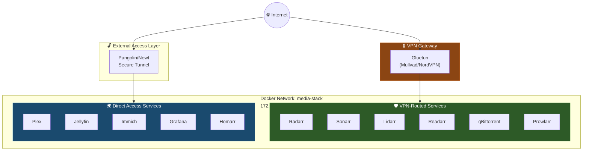
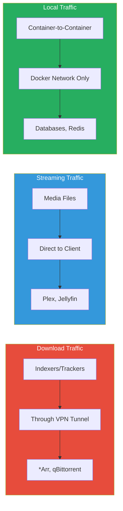
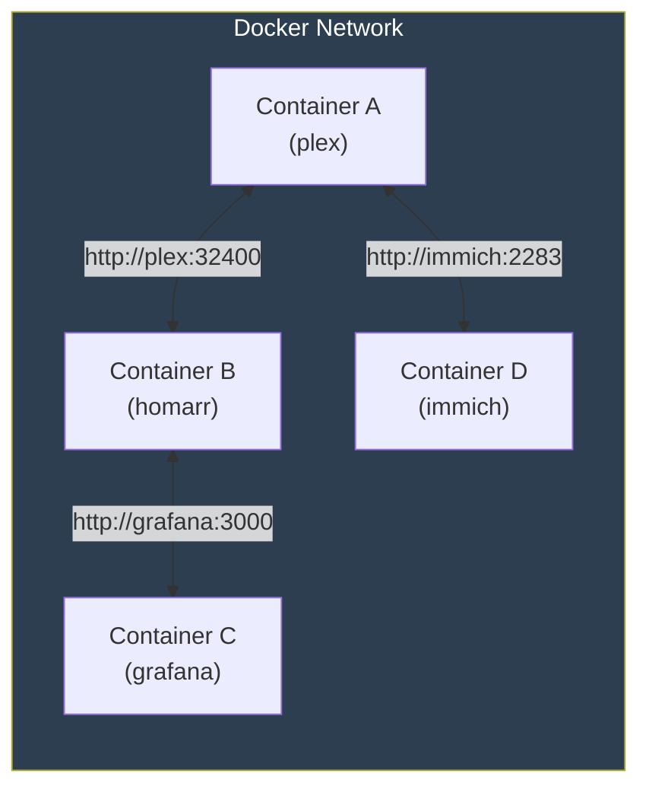
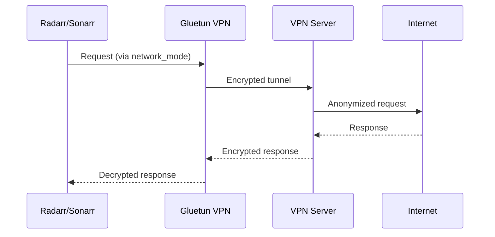
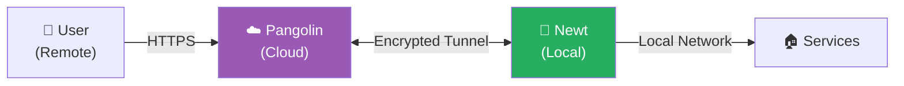
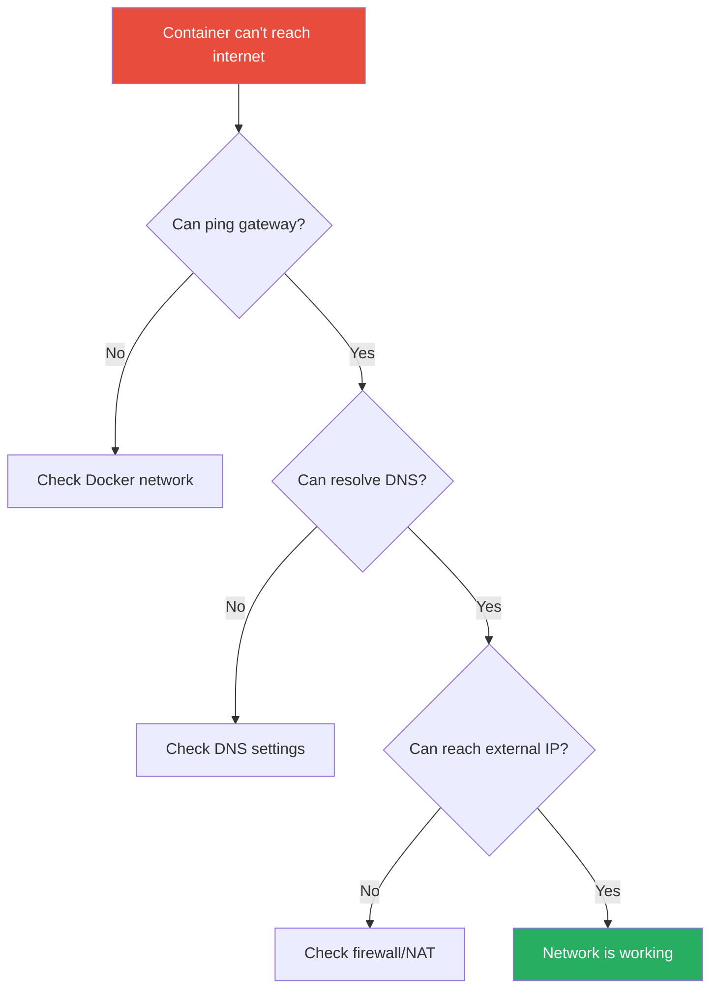
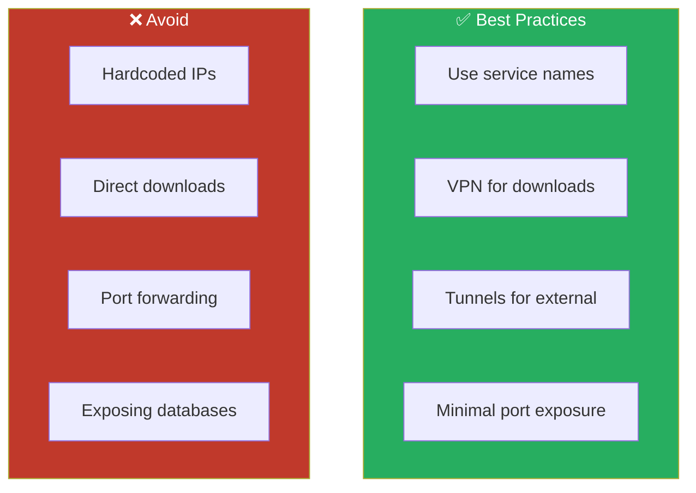

# 🌐 Networking Guide

[← Back to README](../README.md)

Advanced guide to network configuration, VPN routing, and port mappings.

Starter users can ignore most of this page. The default `docker compose up -d` path does not start Gluetun or Newt.

---

## Table of Contents

- [Network Architecture](#network-architecture)
- [Docker Network](#docker-network)
- [VPN Routing](#vpn-routing)
- [Port Reference](#port-reference)
- [External Access](#external-access)
- [Firewall Configuration](#firewall-configuration)
- [Troubleshooting](#troubleshooting-network-issues)

---

## Network Architecture

### Overview



### Traffic Flow



| Traffic Type | Route | Services |
|:-------------|:------|:---------|
| **Download Traffic** | Through VPN tunnel | *Arr stack, qBittorrent, Prowlarr |
| **Streaming Traffic** | Direct to internet | Plex, Jellyfin |
| **Productivity Traffic** | Direct to LAN/clients | FreshRSS, SearXNG, Syncthing, Joplin, Kasm |
| **Documents & Knowledge Traffic** | Direct to LAN/clients | Linkwarden, Paperless-ngx, Stirling-PDF, Karakeep, Docmost |
| **Local Traffic** | Docker network only | Databases, Redis |
| **Monitoring Traffic** | Direct | Prometheus, Grafana |

---

## Docker Network

### Network Configuration

All services share a single bridge network:

```yaml
networks:
  media-stack:
    driver: bridge
    ipam:
      config:
        - subnet: 172.20.0.0/16
```

### Service Discovery



Services can reach each other by service name:

```bash
# From any container
curl http://plex:32400       # Reaches Plex
curl http://grafana:3000     # Reaches Grafana
curl http://immich-server:2283  # Reaches Immich
```

### Network Modes

| Mode | Usage | Services |
|:-----|:------|:---------|
| `bridge` | Standard network access | Most services |
| `network_mode: service:gluetun` | Route through VPN | *Arr stack, downloaders |
| `host` | Direct host network | Plex |

---

## VPN Routing

### How It Works



Services needing VPN use `network_mode: service:gluetun`:

```yaml
radarr:
  network_mode: "service:gluetun"
  # No ports defined here - Gluetun exposes them
```

To keep existing URLs stable, Gluetun keeps exposing the current VPN-routed ports even though the optional services themselves now live in the `media` bundle and are further controlled with profiles:

```yaml
gluetun:
  ports:
    - "8080:8080"   # qBittorrent
    - "9696:9696"   # Prowlarr
    - "7878:7878"   # Radarr
    - "8989:8989"   # Sonarr
    - "8686:8686"   # Lidarr
    - "8787:8787"   # Readarr
    - "6767:6767"   # Bazarr
    - "6969:6969"   # Whisparr
    - "8191:8191"   # FlareSolverr
    - "9998:9998"   # Stash
    - "3333:3333"   # Bitmagnet
```

### VPN-Routed Services

These services only exist after you start the `media` bundle, for example:

```bash
make init BUNDLES="media"
make up BUNDLES="media" PROFILES="arr"
```

| Service | Port | Access URL |
|:--------|:----:|:-----------|
| Radarr | 7878 | `http://your-server:7878` |
| Sonarr | 8989 | `http://your-server:8989` |
| Lidarr | 8686 | `http://your-server:8686` |
| Readarr | 8787 | `http://your-server:8787` |
| Bazarr | 6767 | `http://your-server:6767` |
| Whisparr | 6969 | `http://your-server:6969` |
| Prowlarr | 9696 | `http://your-server:9696` |
| qBittorrent | 8080 | `http://your-server:8080` |
| FlareSolverr | 8191 | `http://your-server:8191` |
| Stash | 9998 | `http://your-server:9998` |
| Bitmagnet | 3333 | `http://your-server:3333` |

### Verify VPN Connection

```bash
# Check your real IP
curl ifconfig.me

# Check VPN container IP (should be different)
docker exec gluetun curl ifconfig.me

# Check Gluetun status
docker compose logs gluetun | tail -20
```

### VPN Firewall Rules

Gluetun includes a kill switch - if VPN disconnects, traffic is blocked:

```yaml
gluetun:
  environment:
    FIREWALL_OUTBOUND_SUBNETS: 172.16.0.0/12,192.168.0.0/16
    # Allows local network access while VPN is active
```

> [!IMPORTANT]
> The kill switch prevents IP leaks. If VPN disconnects, all *Arr traffic stops until reconnection.

---

## Port Reference

### Published Port List

This list focuses on the ports published on the host. Internal-only sidecars stay in the compose files and service-specific docs.

#### Dashboards & Management

| Port | Service | Protocol | Access |
|:----:|:--------|:--------:|:-------|
| 3000 | Grafana | HTTP | Direct |
| 3001 | Uptime Kuma | HTTP | Direct |
| 3002 | Homarr | HTTP | Direct |
| 8889 | Dozzle | HTTP | Direct |
| 9443 | Portainer | HTTPS | Direct |

#### Media Servers

| Port | Service | Protocol | Access |
|:----:|:--------|:--------:|:-------|
| 32400 | Plex | HTTP | Direct |
| 8096 | Jellyfin | HTTP | Direct |
| 9998 | Stash | HTTP | Via Gluetun |
| 5000 | Kavita | HTTP | Direct |
| 4533 | Navidrome | HTTP | Direct |
| 8265 | Tdarr | HTTP | Direct |
| 8266 | Tdarr Server | HTTP | Direct |

#### Photo Management

| Port | Service | Protocol | Access |
|:----:|:--------|:--------:|:-------|
| 2283 | Immich | HTTP | Direct |
| 5432 | PostgreSQL | TCP | Internal |
| 6379 | Redis | TCP | Internal |

#### Productivity

| Port | Service | Protocol | Access |
|:----:|:--------|:--------:|:-------|
| 8083 | FreshRSS | HTTP | Direct |
| 8084 | SearXNG | HTTP | Direct |
| 8384 | Syncthing GUI | HTTP | Direct |
| 22000 | Syncthing Sync | TCP / UDP | Direct |
| 21027 | Syncthing Discovery | UDP | Direct |
| 22300 | Joplin | HTTP | Direct |
| 3003 | Kasm Wizard | HTTPS | Direct, `apps` bundle + `kasm` profile |
| 8444 | Kasm UI | HTTPS | Direct, `apps` bundle + `kasm` profile |

#### Documents & Knowledge

| Port | Service | Protocol | Access |
|:----:|:--------|:--------:|:-------|
| 3006 | Linkwarden | HTTP | Direct |
| 3004 | Docmost | HTTP | Direct |
| 3005 | Karakeep | HTTP | Direct |
| 8010 | Paperless-ngx | HTTP | Direct |
| 8085 | Stirling PDF | HTTP | Direct |

#### Files & Automation

| Port | Service | Protocol | Access |
|:----:|:--------|:--------:|:-------|
| 8443 | Nextcloud | HTTPS | Direct |
| 3923 | Copyparty | HTTP | Loopback only |
| 5678 | n8n | HTTP | Direct |

#### *Arr Stack (VPN-Routed)

| Port | Service | Protocol | Access |
|:----:|:--------|:--------:|:-------|
| 7878 | Radarr | HTTP | Via Gluetun |
| 8989 | Sonarr | HTTP | Via Gluetun |
| 8686 | Lidarr | HTTP | Via Gluetun |
| 8787 | Readarr | HTTP | Via Gluetun |
| 6767 | Bazarr | HTTP | Via Gluetun |
| 6969 | Whisparr | HTTP | Via Gluetun |

#### Downloaders (VPN-Routed)

| Port | Service | Protocol | Access |
|:----:|:--------|:--------:|:-------|
| 8080 | qBittorrent | HTTP | Via Gluetun |
| 9696 | Prowlarr | HTTP | Via Gluetun |
| 8191 | FlareSolverr | HTTP | Via Gluetun |
| 3333 | Bitmagnet | HTTP | Via Gluetun |
| 3334 | Bitmagnet BitTorrent | TCP / UDP | Via Gluetun |
| 6881 | qBittorrent BitTorrent | TCP / UDP | Via Gluetun |

#### Request & Media Tools

| Port | Service | Protocol | Access |
|:----:|:--------|:--------:|:-------|
| 5055 | Overseerr | HTTP | Direct |
| 5056 | Jellyseerr | HTTP | Direct |
| 6246 | Maintainerr | HTTP | Direct |
| 8181 | Tautulli | HTTP | Direct |

#### Monitoring

| Port | Service | Protocol | Access |
|:----:|:--------|:--------:|:-------|
| 3000 | Grafana | HTTP | Direct |
| 3001 | Uptime Kuma | HTTP | Direct |
| 9090 | Prometheus | HTTP | Direct |
| 9093 | AlertManager | HTTP | Direct |
| 9100 | Node Exporter | HTTP | Direct |
| 8765 | Speedtest Tracker | HTTP | Direct |
| 8082 | Scrutiny | HTTP | Direct |
| 61208 | Glances | HTTP | Direct |

#### Utilities

| Port | Service | Protocol | Access |
|:----:|:--------|:--------:|:-------|
| 3002 | Homarr | HTTP | Direct |
| 8088 | Glance | HTTP | Direct |
| 8889 | Dozzle | HTTP | Direct |
| 8200 | Duplicati | HTTP | Direct |
| 8000 | Restic | HTTP | Direct |

---

## External Access

### Option 1: Pangolin/Newt (Recommended)

This path only exists after you start the `access` bundle.



Secure tunnel with authentication:

```yaml
newt:
  environment:
    NEWT_ID: ${NEWT_ID}
    NEWT_SECRET: ${NEWT_SECRET}
    PANGOLIN_ENDPOINT: ${PANGOLIN_ENDPOINT}
```

Starter command path:

```bash
make init BUNDLES="access"
make up BUNDLES="access"
```

### Option 2: Cloudflare Tunnel

Alternative free option:

```bash
# Install cloudflared
docker run cloudflare/cloudflared tunnel --no-autoupdate run --token YOUR_TOKEN
```

### Option 3: Reverse Proxy

Use Traefik or Nginx Proxy Manager:

```yaml
# Example Traefik labels
labels:
  - "traefik.enable=true"
  - "traefik.http.routers.plex.rule=Host(`plex.example.com`)"
```

If you publish Docmost through a custom reverse proxy instead of Pangolin, keep WebSocket upgrades enabled and make sure `DOCMOST_BASE_URL` matches the public URL.

### Port Forwarding (Not Recommended)

> [!WARNING]
> Direct port forwarding bypasses authentication and exposes services to the internet. Use tunnels instead.

If you must expose ports directly:

| Service | Ports to Forward |
|:--------|:-----------------|
| Plex | 32400/tcp |
| Jellyfin | 8096/tcp |

---

## Firewall Configuration

### UFW (Ubuntu)

```bash
# Allow local network
sudo ufw allow from 192.168.0.0/16

# Allow specific ports (if needed)
sudo ufw allow 32400/tcp  # Plex

# Check status
sudo ufw status
```

### Docker and UFW

> [!NOTE]
> Docker modifies iptables directly, bypassing UFW. To fix this, you can disable Docker's iptables management.

```bash
# Edit Docker daemon config
sudo nano /etc/docker/daemon.json
```

```json
{
  "iptables": false
}
```

Then manage ports through UFW.

### iptables (Advanced)

```bash
# List Docker rules
sudo iptables -L DOCKER -n

# Check NAT rules
sudo iptables -t nat -L -n
```

---

## Troubleshooting Network Issues

### Container Can't Reach Internet



```bash
# Test from container
docker exec plex ping -c 3 google.com

# Check DNS
docker exec plex cat /etc/resolv.conf

# Check network
docker network inspect media-stack
```

### VPN Not Connecting

```bash
# Check Gluetun logs
docker compose logs gluetun

# Common issues:
# - Invalid credentials
# - Server region unavailable
# - Port blocked by ISP
```

> [!TIP]
> If VPN keeps disconnecting, try a different server region or check if your ISP is blocking VPN ports.

### Service Not Accessible

```bash
# Check if container is running
docker compose ps

# Check if port is bound
sudo netstat -tlnp | grep 8080

# Check from inside network
docker exec homarr curl http://plex:32400
```

### Container DNS Issues

```bash
# Check DNS resolution
docker exec plex nslookup google.com

# Force DNS server
# Add to service in compose file:
dns:
  - 8.8.8.8
  - 1.1.1.1
```

### Port Conflict

```bash
# Find what's using a port
sudo lsof -i :8080
sudo netstat -tlnp | grep 8080

# Change port in compose file
ports:
  - "8081:8080"  # Use 8081 externally
```

### Network Debugging Commands

```bash
# List all networks
docker network ls

# Inspect specific network
docker network inspect media-stack

# Check container network
docker inspect --format='{{.NetworkSettings.Networks}}' plex

# Test connectivity between containers
docker exec homarr ping -c 3 plex
```

---

## Network Best Practices



1. **Use service names, not IPs**
   ```yaml
   # Good
   PLEX_URL: http://plex:32400

   # Bad
   PLEX_URL: http://172.20.0.15:32400
   ```

2. **Don't expose unnecessary ports**
   - Databases shouldn't be accessible externally
   - Use internal Docker networking

3. **Use VPN for sensitive traffic**
   - All *Arr services route through Gluetun
   - Verify VPN is working regularly

4. **Prefer tunnels over port forwarding**
   - Pangolin/Newt provides authentication
   - Cloudflare Tunnel is a free alternative

---

## Related Documentation

- [Architecture](advanced/architecture.md) - Network topology diagrams
- [Configuration](configuration.md) - VPN setup details
- [Troubleshooting](troubleshooting.md) - More network debugging

---

[← Back to README](../README.md)
