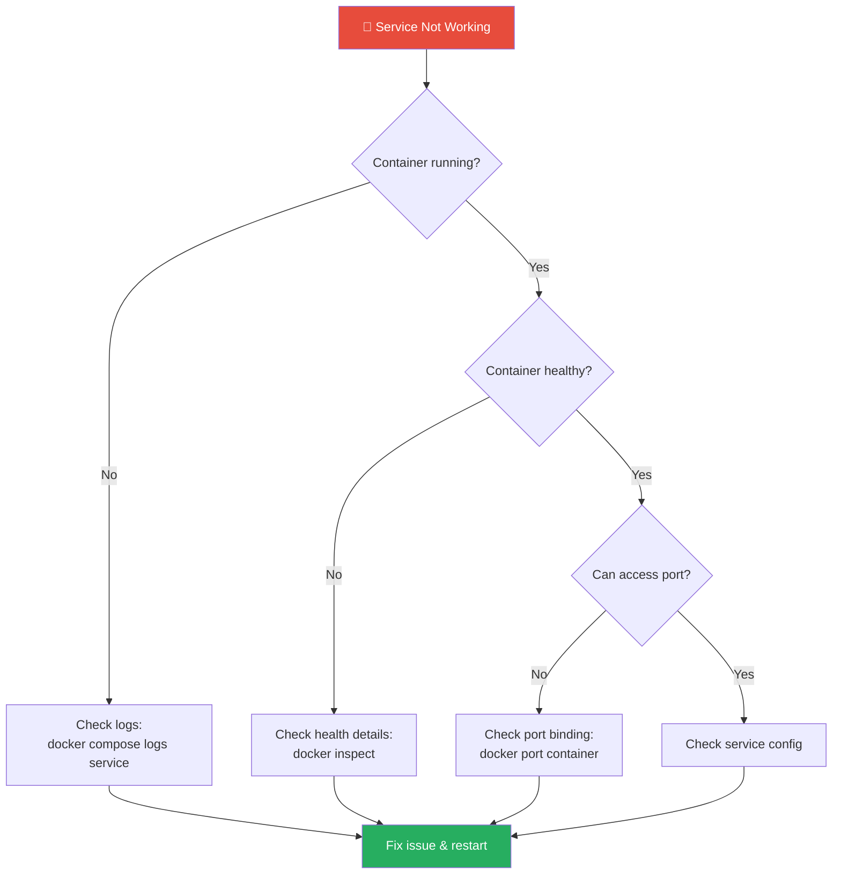

# 🔧 Troubleshooting Guide

[← Back to README](../README.md)

Solutions to common issues, debugging tips, and frequently asked questions.

---

## Table of Contents

- [Quick Diagnostics](#quick-diagnostics)
- [Common Issues](#common-issues)
- [Service-Specific Issues](#service-specific-issues)
- [Debugging Commands](#debugging-commands)
- [Performance Issues](#performance-issues)
- [FAQ](#faq)

---

## Quick Diagnostics

### Network Diagnostics

If services cannot reach external APIs or downloads are slow, start with host and container connectivity checks:

```bash
# Check the VPN gateway first
docker compose logs --tail=100 gluetun

# Verify outbound connectivity from the host
ping -c 10 1.1.1.1
mtr -rwzc 25 1.1.1.1

# Verify outbound connectivity from a specific container
docker exec [container-name] curl -I https://example.com
```

This helps you isolate whether the issue is:
- local to the host
- isolated to the VPN-routed containers
- specific to a remote service or API

See [Utility Scripts](scripts.md) for repo maintenance helpers.

### Health Check Script

Run this to quickly diagnose issues:

```bash
#!/bin/bash
echo "=== Docker Status ==="
docker compose ps

echo -e "\n=== Unhealthy Containers ==="
docker ps --filter "health=unhealthy" --format "{{.Names}}: {{.Status}}"

echo -e "\n=== Recent Errors ==="
docker compose logs --tail=20 2>&1 | grep -i "error\|failed\|fatal"

echo -e "\n=== Disk Space ==="
df -h /opt/media-stack /mnt/media 2>/dev/null

echo -e "\n=== Memory Usage ==="
free -h
```

### Quick Checks

```bash
# Are all containers running?
docker compose ps

# Any unhealthy containers?
docker ps --filter "health=unhealthy"

# Check specific service logs
docker compose logs --tail=50 [service-name]

# Check resource usage
docker stats --no-stream
```

### Diagnostic Flowchart



---

## Common Issues

### Container Won't Start

<details>
<summary><strong>Symptoms:</strong> Container exits immediately or keeps restarting</summary>

**Check logs:**
```bash
docker compose logs [service-name]
```

**Common causes:**

1. **Wrong permissions (PUID/PGID)**
   ```bash
   # Check your user ID
   id

   # Fix in .env
   PUID=1000
   PGID=1000

   # Fix directory ownership
   sudo chown -R 1000:1000 /opt/media-stack/data/[service]
   ```

2. **Missing directories**
   ```bash
   # Create required directories
   mkdir -p /opt/media-stack/data/[service]
   ```

3. **Port already in use**
   ```bash
   # Find what's using the port
   sudo lsof -i :8080
   sudo netstat -tlnp | grep 8080

   # Change port in compose file or stop conflicting service
   ```

4. **Invalid configuration**
   ```bash
   # Validate compose file
   docker compose config

   # Check for syntax errors
   docker compose config --quiet && echo "Config OK"
   ```

</details>

### Permission Denied Errors

<details>
<summary><strong>Symptoms:</strong> "Permission denied" in logs, can't write files</summary>

**Fix ownership:**
```bash
# Fix all data directories
sudo chown -R $USER:$USER /opt/media-stack/data
sudo chown -R $USER:$USER /mnt/media
sudo chown -R $USER:$USER /mnt/photos
```

**Verify PUID/PGID:**
```bash
# Your user ID
id
# uid=1000(youruser) gid=1000(youruser)

# In .env - must match
PUID=1000
PGID=1000
```

**Check specific container:**
```bash
# See what user container runs as
docker exec [container] id
```

> [!TIP]
> Most LinuxServer.io containers use PUID/PGID environment variables. Make sure they match your host user.

</details>

### Container Unhealthy

<details>
<summary><strong>Symptoms:</strong> Container shows "unhealthy" status</summary>

**Check health check details:**
```bash
docker inspect --format='{{json .State.Health}}' [container] | jq
```

**Common causes:**

1. **Service still starting** - Wait 1-2 minutes
2. **Database not ready** - Check dependency services
3. **Configuration error** - Check logs for details

**Force restart:**
```bash
docker compose restart [service]
```

**Recreate container:**
```bash
docker compose up -d --force-recreate [service]
```

</details>

### Can't Connect to Service

<details>
<summary><strong>Symptoms:</strong> Browser shows connection refused/timeout</summary>

**Checklist:**

1. **Container running?**
   ```bash
   docker compose ps [service]
   ```

2. **Container healthy?**
   ```bash
   docker inspect --format='{{.State.Health.Status}}' [container]
   ```

3. **Correct port?**
   ```bash
   # Check exposed ports
   docker port [container]
   ```

4. **Firewall blocking?**
   ```bash
   sudo ufw status
   # If active, allow port:
   sudo ufw allow 8080/tcp
   ```

5. **Service listening?**
   ```bash
   # From inside container
   docker exec [container] netstat -tlnp
   ```

</details>

### VPN Not Working

<details>
<summary><strong>Symptoms:</strong> *Arr apps can't connect, real IP exposed</summary>

**Check Gluetun status:**
```bash
docker compose logs gluetun | tail -50
```

**Verify VPN IP:**
```bash
# Should show VPN IP, not your real IP
docker exec gluetun curl -s ifconfig.me

# Compare to your real IP
curl -s ifconfig.me
```

> [!IMPORTANT]
> If both IPs are the same, your VPN is NOT working. Check credentials and server region.

**Common issues:**

1. **Invalid credentials**
   - Check OPENVPN_USER/PASSWORD in .env
   - Verify with VPN provider

2. **Server unavailable**
   - Try different SERVER_REGIONS
   ```bash
   SERVER_REGIONS=us
   # or
   SERVER_REGIONS=uk
   ```

3. **Port blocked by ISP**
   - Try different VPN protocol
   - Contact ISP or use different port

**Restart VPN:**
```bash
docker compose restart gluetun
```

</details>

### Database Connection Failed

<details>
<summary><strong>Symptoms:</strong> "Connection refused" to PostgreSQL/Redis</summary>

**Check database container:**
```bash
docker compose ps immich_postgres redis
docker compose logs immich_postgres
```

**Test connection:**
```bash
# PostgreSQL
docker exec immich_postgres pg_isready

# Redis
docker exec redis redis-cli ping
```

**Verify credentials:**
```bash
# Check .env
cat .env | grep DB_PASSWORD

# Test connection
docker exec immich_postgres psql -U postgres -c "SELECT 1"
```

**Restart database:**
```bash
docker compose restart immich_postgres redis
```

</details>

### Out of Disk Space

<details>
<summary><strong>Symptoms:</strong> Services crashing, "no space left on device"</summary>

**Check disk usage:**
```bash
df -h

# Docker-specific
docker system df
```

**Clean up Docker:**
```bash
# Remove unused containers, images, networks
docker system prune

# More aggressive (removes all unused images)
docker system prune -a

# Remove unused volumes (CAREFUL - data loss!)
docker volume prune
```

> [!CAUTION]
> `docker volume prune` will delete data! Only use if you're sure no important data is in unused volumes.

**Find large files:**
```bash
# Find large log files
find /opt/media-stack -name "*.log" -size +100M

# Find large directories
du -sh /opt/media-stack/data/* | sort -rh | head -20
```

</details>

---

## Service-Specific Issues

### Plex

<details>
<summary><strong>Transcoding fails / No GPU</strong></summary>

**Check GPU access:**
```bash
docker exec plex nvidia-smi
```

**Verify GPU config:**
```yaml
# In compose file
deploy:
  resources:
    reservations:
      devices:
        - driver: nvidia
          count: all
          capabilities: [gpu]
```

**Check transcoder settings:**
1. Settings → Transcoder
2. Enable "Use hardware acceleration when available"
3. Select correct hardware transcoder

</details>

<details>
<summary><strong>Library not scanning</strong></summary>

**Check permissions:**
```bash
docker exec plex ls -la /media/Movies
```

**Trigger manual scan:**
1. Settings → Libraries
2. Click library → Scan Library Files

**Check logs:**
```bash
docker compose logs plex | grep -i "scan\|library"
```

</details>

### Immich

<details>
<summary><strong>ML not processing / Slow</strong></summary>

**Check ML container:**
```bash
docker compose logs immich_machine_learning
```

**Verify GPU for ML:**
```bash
docker exec immich_machine_learning nvidia-smi
```

**Check ML queue:**
- Administration → Jobs → Machine Learning

**Restart ML:**
```bash
docker compose restart immich_machine_learning
```

> [!NOTE]
> Initial ML processing can take hours for large libraries. Check the job queue for progress.

</details>

<details>
<summary><strong>Upload fails</strong></summary>

**Check storage space:**
```bash
df -h /mnt/photos
```

**Check permissions:**
```bash
ls -la /mnt/photos/upload
```

**Check logs:**
```bash
docker compose logs immich_server | grep -i "upload\|error"
```

</details>

### *Arr Apps (Radarr/Sonarr/etc.)

<details>
<summary><strong>Can't connect to indexers</strong></summary>

**Check VPN:**
```bash
docker exec gluetun curl -s ifconfig.me
```

**Test from container:**
```bash
# Radarr runs through Gluetun
docker exec gluetun curl -s https://api.prowlarr.com
```

**Check Prowlarr:**
```bash
docker compose logs prowlarr
```

</details>

<details>
<summary><strong>Downloads stuck</strong></summary>

**Check qBittorrent:**
```bash
docker compose logs qbittorrent
```

**Verify VPN connection:**
```bash
docker exec gluetun curl -s ifconfig.me
```

**Check download path:**
```bash
docker exec qbittorrent ls -la /downloads
```

</details>

### Grafana

<details>
<summary><strong>No data in dashboards</strong></summary>

**Check Prometheus:**
```bash
docker compose logs prometheus
curl http://localhost:9090/api/v1/targets
```

**Verify data source:**
1. Configuration → Data Sources
2. Click Prometheus → Test

**Check scrape targets:**
- Open `http://your-server:9090/targets`
- All should show "UP"

</details>

### Loki / Logging

<details>
<summary><strong>No data in log dashboards</strong></summary>

**Check Loki is receiving logs:**
```bash
curl http://localhost:3100/loki/api/v1/label/container/values
```

If empty, check Promtail:
```bash
docker compose logs promtail | tail -20
```

**Verify datasource UID:**
- The Loki datasource UID must be `loki` (lowercase)
- Check: Settings → Data Sources → Loki → look at URL, should show `uid=loki`

**Fix datasource UID:**
```bash
# Edit datasources config
nano ${DOCKER_BASE_DIR}/grafana/provisioning/datasources/datasources.yml

# Ensure it has:
#   uid: loki

# Restart Grafana
docker compose restart grafana
```

**Check time range:**
- Set dashboard time range to "Last 15 minutes" or "Last 1 hour"
- Click refresh button

</details>

<details>
<summary><strong>Loki not starting</strong></summary>

**Check logs:**
```bash
docker compose logs loki
```

**Common issues:**

1. **Permission denied:**
   ```bash
   # Loki runs as user 10001
   sudo chown -R 10001:10001 ${DOCKER_BASE_DIR}/loki
   ```

2. **Config syntax error:**
   ```bash
   # Validate config
   docker run --rm -v ${DOCKER_BASE_DIR}/loki/config:/etc/loki grafana/loki:latest \
     -config.file=/etc/loki/local-config.yaml -verify-config
   ```

3. **Port already in use:**
   ```bash
   sudo lsof -i :3100
   ```

</details>

<details>
<summary><strong>Promtail not collecting Docker logs</strong></summary>

**Check Docker socket access:**
```bash
docker exec promtail ls -la /var/run/docker.sock
```

**Verify targets:**
```bash
docker compose logs promtail | grep "added Docker target"
```

**Check Promtail config:**
```bash
cat ${DOCKER_BASE_DIR}/promtail/config/config.yml | grep docker_sd
```

Should have:
```yaml
docker_sd_configs:
  - host: unix:///var/run/docker.sock
```

</details>

<details>
<summary><strong>High Loki disk usage</strong></summary>

**Check storage:**
```bash
du -sh ${DOCKER_BASE_DIR}/loki/data
```

**Reduce retention:**
```bash
# Edit config
nano ${DOCKER_BASE_DIR}/loki/config/local-config.yaml

# Change retention_period (default 744h = 31 days)
limits_config:
  retention_period: 168h  # 7 days

# Restart
docker compose restart loki
```

**Force compaction:**
```bash
docker compose restart loki
```

</details>

---

## Debugging Commands

### Container Operations

```bash
# View all containers
docker compose ps -a

# View logs (last 100 lines, follow)
docker compose logs -f --tail=100 [service]

# Get shell access
docker exec -it [container] /bin/bash
# or for Alpine-based
docker exec -it [container] /bin/sh

# View container details
docker inspect [container]

# Check resource usage
docker stats [container]

# View container processes
docker top [container]
```

### Network Debugging

```bash
# List networks
docker network ls

# Inspect network
docker network inspect media-stack

# Test DNS resolution
docker exec [container] nslookup google.com

# Test connectivity
docker exec [container] ping -c 3 google.com

# Check ports
docker port [container]
```

### Storage Debugging

```bash
# Check mounts
docker inspect -f '{{ .Mounts }}' [container]

# Check disk usage
docker system df -v

# Find large containers
docker ps -s --format "table {{.Names}}\t{{.Size}}"
```

### Log Analysis

```bash
# Search for errors
docker compose logs 2>&1 | grep -i "error\|failed\|fatal"

# Service-specific errors
docker compose logs [service] 2>&1 | grep -i error

# Last hour of logs
docker compose logs --since 1h [service]

# Save logs to file
docker compose logs [service] > service_logs.txt 2>&1
```

---

## Performance Issues

### High CPU Usage

```bash
# Find CPU-hungry containers
docker stats --no-stream --format "table {{.Name}}\t{{.CPUPerc}}" | sort -k2 -rh

# Check specific container
docker exec [container] top -bn1
```

**Common causes:**
- Transcoding without hardware acceleration
- Immich ML processing large backlog
- Database queries without indexes

### High Memory Usage

```bash
# Find memory-hungry containers
docker stats --no-stream --format "table {{.Name}}\t{{.MemUsage}}" | sort -k2 -rh

# Check host memory
free -h
```

**Solutions:**
- Add memory limits to compose files
- Increase swap space
- Reduce concurrent operations

### Slow Network

```bash
# Check host-to-internet latency and loss
ping -c 20 1.1.1.1
mtr -rwzc 50 1.1.1.1

# Test from container
docker exec [container] curl -o /dev/null -s -w "%{time_total}\n" http://google.com

# Check for packet loss
docker exec [container] ping -c 10 google.com
```

> [!TIP]
> Compare host results with the same checks from a VPN-routed container to see whether the slowdown is local, VPN-related, or upstream.

**Solutions:**
- Check VPN server load
- Try different VPN region
- Check local network issues

### Contacting Your ISP

<details>
<summary><strong>Using the ISP Evidence Report</strong></summary>

When repeated `ping`, `mtr`, and throughput checks show upstream issues, save the outputs and contact support:

**Capture evidence:**
```bash
ping -c 50 1.1.1.1 | tee isp-ping.txt
mtr -rwzc 100 1.1.1.1 | tee isp-mtr.txt
```

Repeat those checks during the affected time window so you can show whether packet loss or latency spikes are persistent.

**For Non-Technical Support:**
> "My internet speed is only [X] Mbps when I'm paying for [Y] Mbps.
> I'm also experiencing [Z]% packet loss which causes video calls to drop.
> My diagnostic tests show the problem is in your network equipment at [IP address].
> I have technical documentation I can provide."

**For Technical Support:**
> "I'm experiencing packet loss starting at hop [N] in your infrastructure.
> MTR trace shows [X]% loss at [IP address], affecting routes to [destinations].
> This appears to be an issue with your peering or edge router.
> Can you check interface health on [IP address]?"

**Key metrics to mention:**
- Speed vs expected (percentage)
- Packet loss percentage
- Problem hop IP addresses
- Affected services (VoIP, video, gaming)

</details>

<details>
<summary><strong>Escalation Tips</strong></summary>

1. **Always get a ticket number** - Reference it in follow-ups
2. **Ask for Tier 2/Network Operations** - If first-level support can't help
3. **Provide timestamps** - "Issue occurs daily from 7-10 PM"
4. **Document everything** - Run tests multiple times, save HTML reports
5. **Know your SLA** - Check contract for uptime guarantees

**Red flags that need escalation:**
- Packet loss > 5% consistently
- Speed below 50% of plan
- Same problem hop appearing in multiple tests
- Issues persisting > 24 hours

</details>

### VoIP and Video Call Issues

<details>
<summary><strong>Diagnosing Call Quality Problems</strong></summary>

Run a VoIP-focused test:
```bash
# Check latency and route stability during a call window
ping -i 0.2 -c 50 1.1.1.1
mtr -rwzc 50 1.1.1.1
```

**Check the MOS Score:**
| MOS Score | Call Quality | Action |
|-----------|--------------|--------|
| 4.0+ | Good | No action needed |
| 3.6-4.0 | Fair | May have occasional issues |
| 3.1-3.6 | Poor | Noticeable quality degradation |
| < 3.1 | Bad | Calls likely unusable |

**Common causes and fixes:**

| Issue | Indicator | Solution |
|-------|-----------|----------|
| High latency | MOS < 4.0, latency > 150ms | Use wired connection, closer server |
| Jitter | Choppy audio | Enable QoS on router |
| Packet loss | Audio drops | Check ISP, reduce network load |
| Bufferbloat | Latency spikes under load | Enable SQM/fq_codel on router |

</details>

<details>
<summary><strong>Minimum Requirements by Use Case</strong></summary>

| Use Case | Min MOS | Max Latency | Max Jitter | Max Loss |
|----------|---------|-------------|------------|----------|
| HD Voice | 4.3 | 150ms | 30ms | 1% |
| Video Conferencing | 4.0 | 200ms | 40ms | 2% |
| Standard VoIP | 3.6 | 250ms | 50ms | 3% |
| Basic Voice | 3.1 | 300ms | 70ms | 5% |

If your test results don't meet these thresholds:
1. Try wired instead of WiFi
2. Close bandwidth-heavy applications
3. Check for network congestion
4. Contact ISP if issue persists

</details>

---

## FAQ

<details>
<summary><strong>How much disk space do I need?</strong></summary>

- **Configs**: 1-2 GB
- **Databases**: 5-10 GB (Prometheus, PostgreSQL)
- **Media**: Depends on library size

Recommended: 100 GB SSD for configs, separate storage for media.

</details>

<details>
<summary><strong>Can I run this on a Raspberry Pi?</strong></summary>

Limited support:
- **Pi 4 (8GB)**: Light services only
- **Not recommended**: Plex transcoding, Immich ML

Consider a mini PC or NUC for full stack.

</details>

<details>
<summary><strong>Do I need a domain name?</strong></summary>

No, access via `IP:port` works fine.

Domain needed for:
- SSL/HTTPS certificates
- Pangolin/Newt tunnels
- Remote access via reverse proxy

</details>

<details>
<summary><strong>Why is Immich excluded from Watchtower?</strong></summary>

Immich updates can include:
- Database migrations
- Breaking changes
- ML model updates

Manual updates ensure:
- Time for migrations to complete
- Review of release notes
- Backup before update

> [!WARNING]
> Always backup your Immich database before updating!

</details>

<details>
<summary><strong>How do I add more storage?</strong></summary>

1. Mount new drive to system
2. Update paths in `.env`:
   ```bash
   DOCKER_MEDIA_DIR=/mnt/new-drive
   ```
3. Or create symlinks:
   ```bash
   ln -s /mnt/new-drive/Movies /mnt/media/Movies
   ```
4. Restart affected services

</details>

<details>
<summary><strong>Can I use this without VPN?</strong></summary>

Yes, but not recommended for *Arr stack.

To disable VPN:
1. Comment out Gluetun service
2. Change *Arr services to use bridge network
3. Add ports directly to each service

> [!CAUTION]
> Security tradeoff: Your real IP will be exposed to trackers.

</details>

<details>
<summary><strong>How do I update a single service?</strong></summary>

```bash
# Pull latest image
docker compose pull [service]

# Recreate container
docker compose up -d [service]
```

For Immich:
```bash
# Stop services first
docker compose stop immich_server immich_machine_learning

# Pull and restart
docker compose pull immich_server immich_machine_learning
docker compose up -d immich_server immich_machine_learning
```

</details>

<details>
<summary><strong>How do I completely reset a service?</strong></summary>

```bash
# Stop and remove container
docker compose down [service]

# Remove data (CAREFUL - data loss!)
rm -rf /opt/media-stack/data/[service]

# Recreate directories
mkdir -p /opt/media-stack/data/[service]
chown -R $USER:$USER /opt/media-stack/data/[service]

# Start fresh
docker compose up -d [service]
```

> [!CAUTION]
> This will delete all configuration and data for the service!

</details>

<details>
<summary><strong>Where are the logs stored?</strong></summary>

**Container logs:**
```bash
# View with Docker
docker compose logs [service]

# Raw log files
/var/lib/docker/containers/[container-id]/[container-id]-json.log
```

**Application logs:**
- Usually in `/opt/media-stack/data/[service]/logs/`
- Or check specific service documentation

</details>

<details>
<summary><strong>How do I change a port?</strong></summary>

Edit the compose file:
```yaml
services:
  plex:
    ports:
      - "32401:32400"  # Changed from 32400 to 32401
```

Apply changes:
```bash
docker compose up -d [service]
```

</details>

---

## Getting More Help

### Log Collection for Support

```bash
# Collect diagnostic information
{
  echo "=== System Info ==="
  uname -a
  docker --version
  docker compose version

  echo -e "\n=== Container Status ==="
  docker compose ps -a

  echo -e "\n=== Recent Logs ==="
  docker compose logs --tail=50 2>&1

  echo -e "\n=== Disk Space ==="
  df -h

  echo -e "\n=== Memory ==="
  free -h
} > diagnostic_report.txt
```

### Resources

- [LinuxServer.io Docs](https://docs.linuxserver.io/)
- [Trash Guides](https://trash-guides.info/)
- [Servarr Wiki](https://wiki.servarr.com/)
- [r/selfhosted](https://reddit.com/r/selfhosted)
- [r/homelab](https://reddit.com/r/homelab)

### Use Centralized Logging

For advanced log analysis, use the Loki/Grafana logging stack:
- See [Logging Guide](logging.md) for setup
- Access Grafana dashboards at `http://your-server:3000`
- Pre-built dashboards for container error tracking and per-service log browsing

### Use Dozzle for Real-Time Logs

Access `http://your-server:8889` for a simple web-based log viewer.

---

[← Back to README](../README.md)
